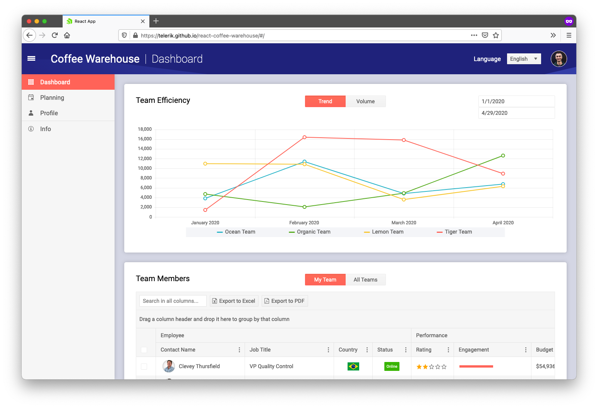
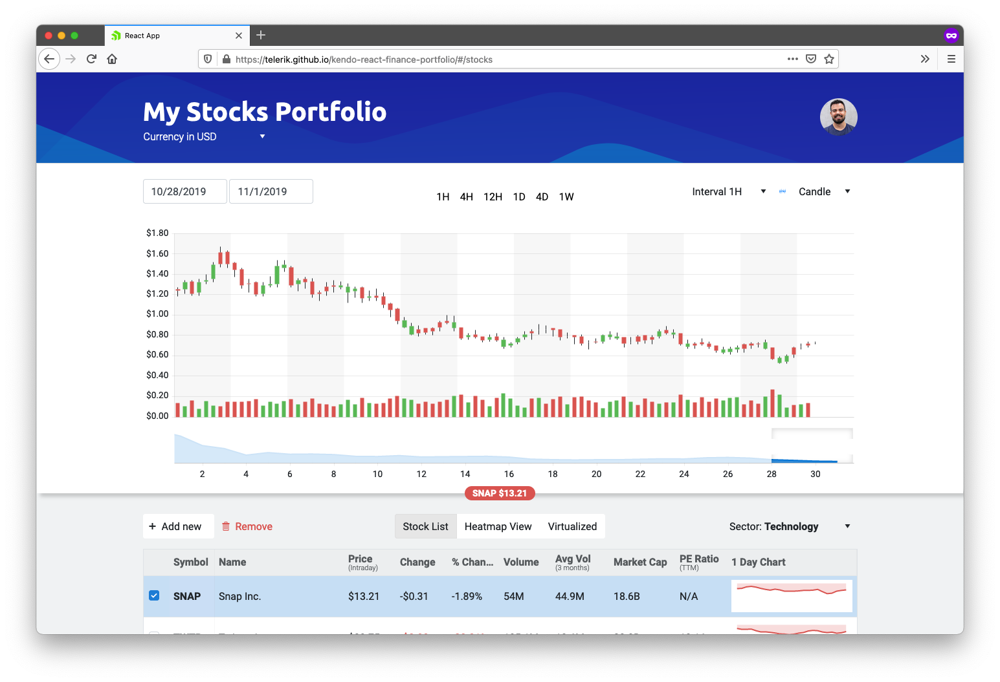
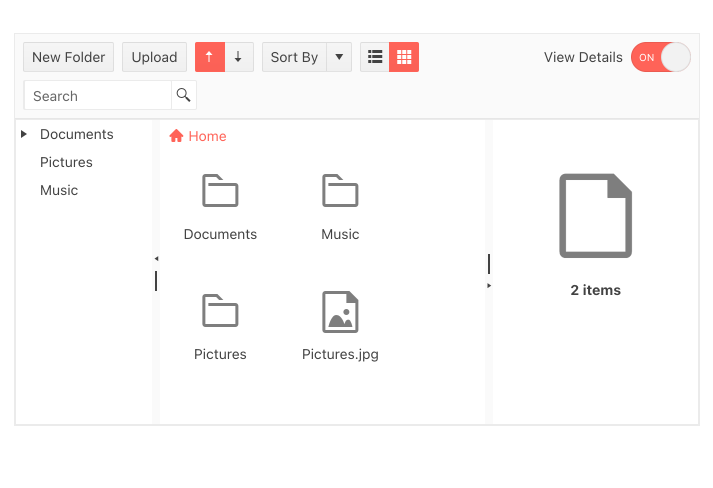
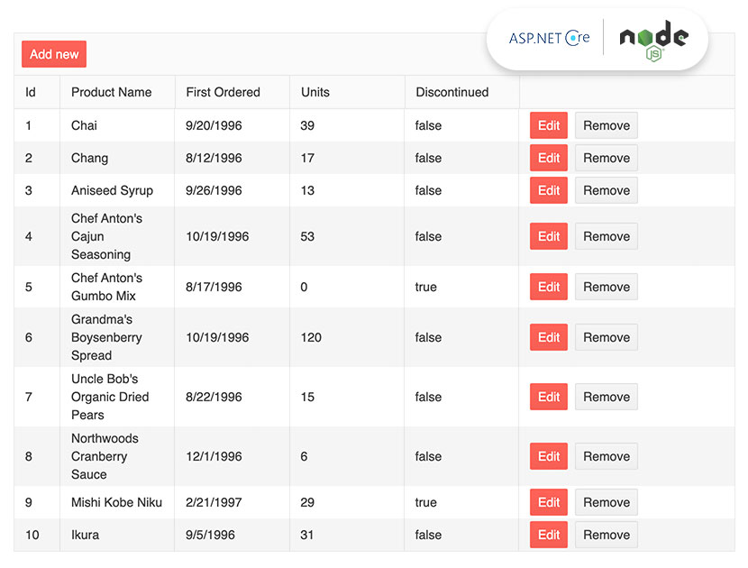

# KendoReact

> **NOTE**: We use this repo as a bug tracker, and to list helpful KendoReact resources. This repository does not contain the KendoReact source code.

***

[KendoReact](https://www.telerik.com/kendo-react-ui?utm_medium=referral&utm_source=github&utm_campaign=kendo-ui-react-trial-gh-public-readme&utm_content=banner) is a professional UI components and data visualization library for React on a mission to help you design and build business apps with React much faster.

***

## Table of Contents

* [Common Support Questions](#common-support-questions)
  * [Where can I find help?](#where-can-i-find-help)
  * [How do I report a bug?](#how-do-i-report-a-bug)
  * [When do you plan to release feature X?](#when-do-you-plan-to-release-feature-x)
* [React UI Components](#react-ui-components)
* [Design-to-Development Support](#design-to-development-support)
* [Sample Applications](#sample-applications)
  * [Coffee Warehouse Dashboard](#user-content-react-dashboard-application)
  * [Financial Portfolio](#user-content-financial-portfolio-application)
  * [File Manager](#user-content-file-manager-template-application)
  * [NodeJS/ASP.NET Core Server](#user-content-react-data-grid-with-nodejs--aspnet-core-server-example)
  * [GitHub Issues Grid](#user-content-github-issues-grid)
* [Useful Links](#useful-links)
* [Licensing](#licensing)

## Common Support Questions

### Where can I find help?

1. For community support we recommend asking questions on our [public forum](https://www.telerik.com/forums/kendo-ui-react) or Stack Overflow using the [kendo-react-ui tag](http://stackoverflow.com/questions/tagged/kendo-react-ui).
1. KendoReact license holders can use our official support channel to [submit support tickets](https://www.telerik.com/account/support-tickets).

### How do I report a bug?

If you want to report a bug with KendoReact, please start by reviewing [this repo’s issue tracker](https://github.com/telerik/kendo-react/issues) to make sure your issue has not already been reported. If you can’t find your issue there, please follow the following reproduction steps:

1. Find an example in [the KendoReact documentation](https://www.telerik.com/kendo-react-ui/components/) that looks similar to your use case.
1. Open that example in StackBlitz by using the **EDIT IN STACKBLITZ** button.
1. Fork the StackBlitz project by using the **FORK** button at the top of the StackBlitz interface.
1. Modify the code in your StackBlitz project so that it shows the issue you’re having with KendoReact. Try to include the minimum possible amount of code.
1. Save your StackBlitz project by using the **SAVE** button at the top of the StackBlitz interface.
1. Copy the URL of your StackBlitz project from your browser’s address bar.
1. [Open a new issue in this repo](https://github.com/telerik/kendo-react/issues/new) and your StackBlitz link in the description.
1. Provide any additional information necessary for us to reproduce the problem, such as browser version, steps to perform, etc.

> We might not be able to act on issues without a runnable demo.

If you need assistance on troubleshooting or isolating a problem, you can request a remote assistance session through our [Support Ticket](https://www.telerik.com/account/support-center/contact-us/technical-support) system. Remote Assistance is included in our [Ultimate Support](https://www.telerik.com/kendo-react-ui/pricing?utm_medium=referral&utm_source=github&utm_campaign=kendo-ui-react-trial-gh-public-readme) subscription.

### When do you plan to release feature X?

1. Check the [KendoReact Roadmap](https://www.telerik.com/support/whats-new/kendo-react-ui/roadmap) to see a list of features we have planned.
1. If your feature isn’t listed there, [check our feedback portal](https://feedback.telerik.com/kendo-react-ui). If you don’t see your feature on our portal, you can request the feature there.

## React UI Components

### Animations

<table><tbody>
<tr>
  <td><b>Animation</b></td>
  <td><a href="https://www.telerik.com/kendo-react-ui/animation">React Animation Features</a></td>
  <td><a href="https://www.telerik.com/kendo-react-ui/components/animation/">Documentation & Demos</td>
</tr>
</tbody></table>

### Barcodes

<table><tbody>
<tr>
  <td><b>Barcode</b></td>
  <td><a href="https://www.telerik.com/kendo-react-ui/barcode">React Barcode Features</a></td>
  <td><a href="https://www.telerik.com/kendo-react-ui/components/barcodes/barcode/">Documentation & Demos</td>
</tr>
 <tr>
  <td><b>QR Code</b></td>
  <td><a href="https://www.telerik.com/kendo-react-ui/qrcode">React QR Code Features</a></td>
  <td><a href="https://www.telerik.com/kendo-react-ui/components/barcodes/qrcode/">Documentation & Demos</td>
</tr>
</tbody></table>

### Buttons

<table><tbody>
<tr>
  <td><b>Button</b></td>
  <td><a href="https://www.telerik.com/kendo-react-ui/button">React Button Features</a></td>
  <td><a href="https://www.telerik.com/kendo-react-ui/components/buttons/">Documentation & Demos</td>
</tr>
<tr>
  <td><b>ButtonGroup</b></td>
  <td><a href="https://www.telerik.com/kendo-react-ui/buttongroup">React ButtonGroup Features</a></td>
  <td><a href="https://www.telerik.com/kendo-react-ui/components/buttons/buttongroup/">Documentation & Demos</td>
</tr>
<tr>
  <td><b>Chip</b></td>
  <td><a href="https://www.telerik.com/kendo-react-ui/chip">React Chip Features</a></td>
  <td><a href="https://www.telerik.com/kendo-react-ui/components/buttons/chip/">Documentation & Demos</td>
</tr>
<tr>
  <td><b>ChipList</b></td>
  <td><a href="https://www.telerik.com/kendo-react-ui/chiplist">React ChipList Features</a></td>
  <td><a href="https://www.telerik.com/kendo-react-ui/components/buttons/chiplist/">Documentation & Demos</td>
</tr>
<tr>
  <td><b>DropDownButton</b></td>
  <td><a href="https://www.telerik.com/kendo-react-ui/dropdownbutton">React DropDownButton Features</a></td>
  <td><a href="https://www.telerik.com/kendo-react-ui/components/buttons/dropdownbutton/">Documentation & Demos</td>
</tr>
<tr>
  <td><b>FloatingActionButton</b></td>
  <td><a href="https://www.telerik.com/kendo-react-ui/floatingactionbutton">React Floating Action Button Features</a></td>
  <td><a href="https://www.telerik.com/kendo-react-ui/components/buttons/floatingactionbutton/">Documentation & Demos</td>
</tr>
<tr>
  <td><b>SplitButton</b></td>
  <td><a href="https://www.telerik.com/kendo-react-ui/splitbutton">React SplitButton Features</a></td>
  <td><a href="https://www.telerik.com/kendo-react-ui/components/buttons/splitbutton/">Documentation & Demos</td>
</tr>
<tr>
  <td><b>Toolbar</b></td>
  <td><a href="https://www.telerik.com/kendo-react-ui/toolbar">React Toolbar Features</a></td>
  <td><a href="https://www.telerik.com/kendo-react-ui/components/buttons/toolbar/">Documentation & Demos</td>
</tr>
</tbody></table>

### Charts

<table><tbody>
 <tr>
  <td><b>Chart</b></td>
  <td><a href="https://www.telerik.com/kendo-react-ui/charts">React Chart Features</a></td>
  <td><a href="https://www.telerik.com/kendo-react-ui/components/charts/">Documentation & Demos</td>
</tr>
<tr>
  <td><b>Heatmap</b></td>
  <td><a href="https://www.telerik.com/kendo-react-ui/heatmap">React Heatmap Features</a></td>
  <td><a href="https://www.telerik.com/kendo-react-ui/components/charts/series-types/heatmap/">Documentation & Demos</td>
</tr>
 <tr>
  <td><b>Sparkline</b></td>
  <td><a href="https://www.telerik.com/kendo-react-ui/sparkline">React Sparkline Features</a></td>
  <td><a href="https://www.telerik.com/kendo-react-ui/components/charts/sparkline/">Documentation & Demos</td>
</tr>
 <tr>
  <td><b>Area Chart</b></td>
  <td><a href="https://www.telerik.com/kendo-react-ui/area-chart">React Area Chart Features</a></td>
  <td><a href="https://www.telerik.com/kendo-react-ui/components/charts/series-types/area/">Documentation & Demos</td>
</tr>
 <tr>
  <td><b>Bar Chart</b></td>
  <td><a href="https://www.telerik.com/kendo-react-ui/bar-chart">React Bar Chart Features</a></td>
  <td><a href="https://www.telerik.com/kendo-react-ui/components/charts/series-types/bar/">Documentation & Demos</td>
</tr>
 <tr>
  <td><b>Box Plot</b></td>
  <td><a href="https://www.telerik.com/kendo-react-ui/box-plot">React Box Plot Features</a></td>
  <td><a href="https://www.telerik.com/kendo-react-ui/components/charts/series-types/box-plot/">Documentation & Demos</td>
</tr>
 <tr>
  <td><b>Bubble Chart</b></td>
  <td><a href="https://www.telerik.com/kendo-react-ui/bubble-chart">React Bubble Chart Features</a></td>
  <td><a href="https://www.telerik.com/kendo-react-ui/components/charts/series-types/bubble/">Documentation & Demos</td>
</tr>
 <tr>
  <td><b>Donut Chart</b></td>
  <td><a href="https://www.telerik.com/kendo-react-ui/donut-chart">React Donut Chart Features</a></td>
  <td><a href="https://www.telerik.com/kendo-react-ui/components/charts/series-types/donut/">Documentation & Demos</td>
</tr>
<tr>
  <td><b>Funnel Chart</b></td>
  <td><a href="https://www.telerik.com/kendo-react-ui/funnel-chart">React Funnel Chart Features</a></td>
  <td><a href="https://www.telerik.com/kendo-react-ui/components/charts/series-types/funnel/">Documentation & Demos</td>
</tr>
<tr>
  <td><b>Line Chart</b></td>
  <td><a href="https://www.telerik.com/kendo-react-ui/line-chart">React Line Chart Features</a></td>
  <td><a href="https://www.telerik.com/kendo-react-ui/components/charts/series-types/line/">Documentation & Demos</td>
</tr>
<tr>
  <td><b>Pie Chart</b></td>
  <td><a href="https://www.telerik.com/kendo-react-ui/pie-chart">React Pie Chart Features</a></td>
  <td><a href="https://www.telerik.com/kendo-react-ui/components/charts/series-types/pie/">Documentation & Demos</td>
</tr>
<tr>
  <td><b>Polar Chart</b></td>
  <td><a href="https://www.telerik.com/kendo-react-ui/polar-chart">React Polar Chart Features</a></td>
  <td><a href="https://www.telerik.com/kendo-react-ui/components/charts/series-types/polar/">Documentation & Demos</td>
</tr>
<tr>
  <td><b>Pyramid Chart</b></td>
  <td><a href="https://www.telerik.com/kendo-react-ui/pyramid-chart">React Pyramid Chart Features</a></td>
  <td><a href="https://www.telerik.com/kendo-react-ui/components/charts/series-types/pyramid/">Documentation & Demos</td>
</tr>
<tr>
  <td><b>Radar Chart</b></td>
  <td><a href="https://www.telerik.com/kendo-react-ui/radar-chart">React Radar Chart Features</a></td>
  <td><a href="https://www.telerik.com/kendo-react-ui/components/charts/series-types/radar/">Documentation & Demos</td>
</tr>
<tr>
  <td><b>Range Area Chart</b></td>
  <td><a href="https://www.telerik.com/kendo-react-ui/range-area-chart">React Range Area Chart Features</a></td>
  <td><a href="https://www.telerik.com/kendo-react-ui/components/charts/series-types/range-area/">Documentation & Demos</td>
</tr>
<tr>
  <td><b>Scatter Chart</b></td>
  <td><a href="https://www.telerik.com/kendo-react-ui/scatter-chart">React Scatter Chart Features</a></td>
  <td><a href="https://www.telerik.com/kendo-react-ui/components/charts/series-types/scatter/">Documentation & Demos</td>
</tr>
</tbody></table>

### Common Utilities

<table><tbody>
<tr>
  <td><b>Drag&Drop Utilities</b></td>
  <td><a href="https://www.telerik.com/kendo-react-ui/drag-and-drop">React Drag&Drop Utilities Features</a></td>
  <td><a href="https://www.telerik.com/kendo-react-ui/components/common/drag-and-drop/">Documentation & Demos</td>
</tr>
 <tr>
  <td><b>Typography</b></td>
  <td><a href="https://www.telerik.com/kendo-react-ui/typography">React Typography Features</a></td>
  <td><a href="https://www.telerik.com/kendo-react-ui/components/common/typography/">Documentation & Demos</td>
</tr>
 <tr>
  <td><b>Icon & SVG Icon</b></td>
  <td><a href="https://www.telerik.com/kendo-react-ui/icon-svgicon">React Icon & SVG Icon Features</a></td>
  <td><a href="https://www.telerik.com/kendo-react-ui/components/common/icon/">Documentation & Demos</td>
</tr>
</tbody></table>

### Conversational UI

<table><tbody>
<tr>
  <td><b>Conversational UI</b></td>
  <td><a href="https://www.telerik.com/kendo-react-ui/conversationalui">React Conversational UI Features</a></td>
  <td><a href="https://www.telerik.com/kendo-react-ui/components/conversationalui/">Documentation & Demos</td>
</tr>
</tbody></table>

### Data Grid

<table><tbody>
<tr>
  <td><b>Data Grid</b></td>
  <td><a href="https://www.telerik.com/kendo-react-ui/grid">React Data Grid Features</a></td>
  <td><a href="https://www.telerik.com/kendo-react-ui/components/grid/">Documentation & Demos</td>
</tr>
</tbody></table>

### Data Query

<table><tbody>
<tr>
  <td><b>Data Query</b></td>
  <td><a href="https://www.telerik.com/kendo-react-ui/dataquery">React Data Query Features</a></td>
  <td><a href="https://www.telerik.com/kendo-react-ui/components/dataquery/">Documentation & Demos</td>
</tr>
</tbody></table>

### Data Tools

<table><tbody>
<tr>
  <td><b>Filter</b></td>
  <td><a href="https://www.telerik.com/kendo-react-ui/filter">React Filter Features</a></td>
  <td><a href="https://www.telerik.com/kendo-react-ui/components/datatools/filter/">Documentation & Demos</td>
</tr>
<tr>
  <td><b>Pager</b></td>
  <td><a href="https://www.telerik.com/kendo-react-ui/pager">React Pager Features</a></td>
  <td><a href="https://www.telerik.com/kendo-react-ui/components/datatools/pager/">Documentation & Demos</td>
</tr>
</tbody></table>

### Date Inputs

<table><tbody>
<tr>
  <td><b>Calendar</b></td>
  <td><a href="https://www.telerik.com/kendo-react-ui/calendar">React Calendar Features</a></td>
  <td><a href="https://www.telerik.com/kendo-react-ui/components/dateinputs/calendar/">Documentation & Demos</td>
</tr>
<tr>
  <td><b>DateInput</b></td>
  <td><a href="https://www.telerik.com/kendo-react-ui/dateinput">React DateInput Features</a></td>
  <td><a href="https://www.telerik.com/kendo-react-ui/components/dateinputs/dateinput/">Documentation & Demos</td>
</tr>
<tr>
  <td><b>DatePicker</b></td>
  <td><a href="https://www.telerik.com/kendo-react-ui/datepicker">React DatePicker Features</a></td>
  <td><a href="https://www.telerik.com/kendo-react-ui/components/dateinputs/datepicker/">Documentation & Demos</td>
</tr>
<tr>
  <td><b>DateRangePicker</b></td>
  <td><a href="https://www.telerik.com/kendo-react-ui/daterangepicker">React DateRangePicker Features</a></td>
  <td><a href="https://www.telerik.com/kendo-react-ui/components/dateinputs/daterangepicker/">Documentation & Demos</td>
</tr>
<tr>
  <td><b>DateTimePicker</b></td>
  <td><a href="https://www.telerik.com/kendo-react-ui/datetimepicker">React DateTimePicker Features</a></td>
  <td><a href="https://www.telerik.com/kendo-react-ui/components/dateinputs/datetimepicker/">Documentation & Demos</td>
</tr>
<tr>
  <td><b>MultiViewCalendar</b></td>
  <td><a href="https://www.telerik.com/kendo-react-ui/multiviewcalendar">React MultiViewCalendar Features</a></td>
  <td><a href="https://www.telerik.com/kendo-react-ui/components/dateinputs/multiviewcalendar/">Documentation & Demos</td>
</tr>
<tr>
  <td><b>TimePicker</b></td>
  <td><a href="https://www.telerik.com/kendo-react-ui/timepicker">React TimePicker Features</a></td>
  <td><a href="https://www.telerik.com/kendo-react-ui/components/dateinputs/timepicker/">Documentation & Demos</td>
</tr>
</tbody></table>

### Date Math

<table><tbody>
<tr>
  <td><b>Date Math</b></td>
  <td><a href="https://www.telerik.com/kendo-react-ui/datemath">React Date Math Features</a></td>
  <td><a href="https://www.telerik.com/kendo-react-ui/components/datemath/">Documentation & Demos</td>
</tr>
</tbody></table>

### Dialogs

<table><tbody>
<tr>
  <td><b>Dialog</b></td>
  <td><a href="https://www.telerik.com/kendo-react-ui/dialog">React Dialog Features</a></td>
  <td><a href="https://www.telerik.com/kendo-react-ui/components/dialogs/dialog/">Documentation & Demos</td>
</tr>
<tr>
  <td><b>Window</b></td>
  <td><a href="https://www.telerik.com/kendo-react-ui/window">React Window Features</a></td>
  <td><a href="https://www.telerik.com/kendo-react-ui/components/dialogs/window/">Documentation & Demos</td>
</tr>
</tbody></table>

### Drawing

<table><tbody>
<tr>
  <td><b>Drawing Library</b></td>
  <td><a href="https://www.telerik.com/kendo-react-ui/drawing">React Drawing Library Features</a></td>
  <td><a href="https://www.telerik.com/kendo-react-ui/components/drawing/">Documentation & Demos</td>
</tr>
</tbody></table>

### Dropdowns

<table><tbody>
<tr>
  <td><b>AutoComplete</b></td>
  <td><a href="https://www.telerik.com/kendo-react-ui/autocomplete">React AutoComplete Features</a></td>
  <td><a href="https://www.telerik.com/kendo-react-ui/components/dropdowns/autocomplete/">Documentation & Demos</td>
</tr>
<tr>
  <td><b>ComboBox</b></td>
  <td><a href="https://www.telerik.com/kendo-react-ui/combobox">React ComboBox Features</a></td>
  <td><a href="https://www.telerik.com/kendo-react-ui/components/dropdowns/combobox/">Documentation & Demos</td>
</tr>
<tr>
  <td><b>DropDownList</b></td>
  <td><a href="https://www.telerik.com/kendo-react-ui/dropdownlist">React DropDownList Features</a></td>
  <td><a href="https://www.telerik.com/kendo-react-ui/components/dropdowns/dropdownlist/">Documentation & Demos</td>
</tr>
<tr>
  <td><b>DropDownTree</b></td>
  <td><a href="https://www.telerik.com/kendo-react-ui/dropdowntree">React DropDownTree Features</a></td>
  <td><a href="https://www.telerik.com/kendo-react-ui/components/dropdowns/dropdowntree/">Documentation & Demos</td>
</tr>
<tr>
  <td><b>MultiColumnComboBox</b></td>
  <td><a href="https://www.telerik.com/kendo-react-ui/multicolumncombobox">React MultiColumn ComboBox Features</a></td>
  <td><a href="https://www.telerik.com/kendo-react-ui/components/dropdowns/multicolumncombobox/">Documentation & Demos</td>
</tr>
<tr>
  <td><b>MultiSelect</b></td>
  <td><a href="https://www.telerik.com/kendo-react-ui/multiselect">React MultiSelect Features</a></td>
  <td><a href="https://www.telerik.com/kendo-react-ui/components/dropdowns/multiselect/">Documentation & Demos</td>
</tr>
 <tr>
  <td><b>MultiSelect Tree</b></td>
  <td><a href="https://www.telerik.com/kendo-react-ui/multiselecttree">React MultiSelect Tree Features</a></td>
  <td><a href="https://www.telerik.com/kendo-react-ui/components/dropdowns/multiselecttree/">Documentation & Demos</td>
</tr>
</tbody></table>

### Editor

<table><tbody>
<tr>
  <td><b>Editor</b></td>
  <td><a href="https://www.telerik.com/kendo-react-ui/editor">React Editor Features</a></td>
  <td><a href="https://www.telerik.com/kendo-react-ui/components/editor/">Documentation & Demos</td>
</tr>
</tbody></table>

### Excel Export

<table><tbody>
<tr>
  <td><b>Excel Export</b></td>
  <td><a href="https://www.telerik.com/kendo-react-ui/excelexport">React Excel Export Features</a></td>
  <td><a href="https://www.telerik.com/kendo-react-ui/components/excelexport/">Documentation & Demos</td>
</tr>
</tbody></table>

### File Saver

<table><tbody>
<tr>
  <td><b>File Saver</b></td>
  <td><a href="https://www.telerik.com/kendo-react-ui/filesaver">React File Saver Features</a></td>
  <td><a href="https://www.telerik.com/kendo-react-ui/components/filesaver/">Documentation & Demos</td>
</tr>
</tbody></table>

### Form

<table><tbody>
<tr>
  <td><b>Form</b></td>
  <td><a href="https://www.telerik.com/kendo-react-ui/form">React Form Features</a></td>
  <td><a href="https://www.telerik.com/kendo-react-ui/components/form/">Documentation & Demos</td>
</tr>
 <tr>
  <td><b>FieldArray</b></td>
  <td><a href="https://www.telerik.com/kendo-react-ui/fieldarray">React FieldArray Features</a></td>
  <td><a href="https://www.telerik.com/kendo-react-ui/components/form/validation/#toc-fieldarray-validation">Documentation & Demos</td>
</tr>
 <tr>
  <td><b>FieldWrapper</b></td>
  <td><a href="https://www.telerik.com/kendo-react-ui/fieldwrapper">React FieldWrapper Features</a></td>
  <td><a href="https://www.telerik.com/kendo-react-ui/components/form/api/FieldWrapper/">Documentation & Demos</td>
</tr>
 <tr>
  <td><b>FormElement</b></td>
  <td><a href="https://www.telerik.com/kendo-react-ui/formelement">React FormElement Features</a></td>
  <td><a href="https://www.telerik.com/kendo-react-ui/components/form/api/FormElement/">Documentation & Demos</td>
</tr>
</tbody></table>

### Gantt

<table><tbody>
<tr>
  <td><b>Gantt</b></td>
  <td><a href="https://www.telerik.com/kendo-react-ui/gantt-chart">React Gantt Chart Features</a></td>
  <td><a href="https://www.telerik.com/kendo-react-ui/components/gantt/">Documentation & Demos</td>
</tr>
</tbody></table>

### Gauges

<table><tbody>
<tr>
  <td><b>Arc Gauge</b></td>
  <td><a href="https://www.telerik.com/kendo-react-ui/arcgauge">React Arc Gauge Features</a></td>
  <td><a href="https://www.telerik.com/kendo-react-ui/components/gauges/arcgauge/">Documentation & Demos</td>
</tr>
 <tr>
  <td><b>Circular Gauge</b></td>
  <td><a href="https://www.telerik.com/kendo-react-ui/circulargauge">React Circular Gauge Features</a></td>
  <td><a href="https://www.telerik.com/kendo-react-ui/components/gauges/circulargauge/">Documentation & Demos</td>
</tr>
<tr>
  <td><b>Linear Gauge</b></td>
  <td><a href="https://www.telerik.com/kendo-react-ui/lineargauge">React Linear Gauge Features</a></td>
  <td><a href="https://www.telerik.com/kendo-react-ui/components/gauges/lineargauge/">Documentation & Demos</td>
</tr>
<tr>
  <td><b>Radial Gauge</b></td>
  <td><a href="https://www.telerik.com/kendo-react-ui/radialgauge">React Radial Gauge Features</a></td>
  <td><a href="https://www.telerik.com/kendo-react-ui/components/gauges/radialgauge/">Documentation & Demos</td>
</tr>
</tbody></table>

### Indicators

<table><tbody>
<tr>
  <td><b>Badge</b></td>
  <td><a href="https://www.telerik.com/kendo-react-ui/badge">React Badge Features</a></td>
  <td><a href="https://www.telerik.com/kendo-react-ui/components/indicators/badge/">Documentation & Demos</td>
</tr>
<tr>
  <td><b>Loader</b></td>
  <td><a href="https://www.telerik.com/kendo-react-ui/loader">React Loader Features</a></td>
  <td><a href="https://www.telerik.com/kendo-react-ui/components/indicators/loader/">Documentation & Demos</td>
</tr>
 <tr>
  <td><b>Skeleton</b></td>
  <td><a href="https://www.telerik.com/kendo-react-ui/skeleton">React Skeleton Features</a></td>
  <td><a href="https://www.telerik.com/kendo-react-ui/components/indicators/skeleton/">Documentation & Demos</td>
</tr>
</tbody></table>

### Inputs

<table><tbody>
<tr>
  <td><b>Checkbox</b></td>
  <td><a href="https://www.telerik.com/kendo-react-ui/checkbox">React Checkbox Features</a></td>
  <td><a href="https://www.telerik.com/kendo-react-ui/components/inputs/checkbox/">Documentation & Demos</td>
</tr>
<tr>
  <td><b>ColorGradient</b></td>
  <td><a href="https://www.telerik.com/kendo-react-ui/colorgradient">React ColorGradient Features</a></td>
  <td><a href="https://www.telerik.com/kendo-react-ui/components/inputs/colorgradient/">Documentation & Demos</td>
</tr>
<tr>
  <td><b>ColorPalette</b></td>
  <td><a href="https://www.telerik.com/kendo-react-ui/colorpalette">React ColorPalette Features</a></td>
  <td><a href="https://www.telerik.com/kendo-react-ui/components/inputs/colorpalette/">Documentation & Demos</td>
</tr>
<tr>
  <td><b>ColorPicker</b></td>
  <td><a href="https://www.telerik.com/kendo-react-ui/colorpicker">React ColorPicker Features</a></td>
  <td><a href="https://www.telerik.com/kendo-react-ui/components/inputs/colorpicker/">Documentation & Demos</td>
</tr>
 <tr>
  <td><b>FlatColorPicker</b></td>
  <td><a href="https://www.telerik.com/kendo-react-ui/flatcolorpicker">React FlatColorPicker Features</a></td>
  <td><a href="https://www.telerik.com/kendo-react-ui/components/inputs/flatcolorpicker/">Documentation & Demos</td>
</tr>
<tr>
  <td><b>Input</b></td>
  <td><a href="https://www.telerik.com/kendo-react-ui/input">React Input Features</a></td>
  <td><a href="https://www.telerik.com/kendo-react-ui/components/inputs/input/">Documentation & Demos</td>
</tr>
<tr>
  <td><b>MaskedTextBox</b></td>
  <td><a href="https://www.telerik.com/kendo-react-ui/maskedtextbox">React MaskedTextBox Features</a></td>
  <td><a href="https://www.telerik.com/kendo-react-ui/components/inputs/maskedtextbox/">Documentation & Demos</td>
</tr>
<tr>
  <td><b>NumericTextBox</b></td>
  <td><a href="https://www.telerik.com/kendo-react-ui/numerictextbox">React NumericTextBox Features</a></td>
  <td><a href="https://www.telerik.com/kendo-react-ui/components/inputs/numerictextbox/">Documentation & Demos</td>
</tr>
<tr>
  <td><b>RadioButton</b></td>
  <td><a href="https://www.telerik.com/kendo-react-ui/radiobutton">React RadioButton Features</a></td>
  <td><a href="https://www.telerik.com/kendo-react-ui/components/inputs/radiobutton/">Documentation & Demos</td>
</tr>
<tr>
  <td><b>RadioButtonGroup</b></td>
  <td><a href="https://www.telerik.com/kendo-react-ui/radiogroup">React RadioButtonGroup Features</a></td>
  <td><a href="https://www.telerik.com/kendo-react-ui/components/inputs/radiogroup/">Documentation & Demos</td>
</tr>
<tr>
  <td><b>RangeSlider</b></td>
  <td><a href="https://www.telerik.com/kendo-react-ui/rangeslider">React RangeSlider Features</a></td>
  <td><a href="https://www.telerik.com/kendo-react-ui/components/inputs/rangeslider/">Documentation & Demos</td>
</tr>
<tr>
  <td><b>Rating</b></td>
  <td><a href="https://www.telerik.com/kendo-react-ui/rating">React Rating Features</a></td>
  <td><a href="https://www.telerik.com/kendo-react-ui/components/inputs/rating/">Documentation & Demos</td>
</tr>
<tr>
  <td><b>Slider</b></td>
  <td><a href="https://www.telerik.com/kendo-react-ui/slider">React Slider Features</a></td>
  <td><a href="https://www.telerik.com/kendo-react-ui/components/inputs/slider/">Documentation & Demos</td>
</tr>
<tr>
  <td><b>Switch</b></td>
  <td><a href="https://www.telerik.com/kendo-react-ui/switch">React Switch Features</a></td>
  <td><a href="https://www.telerik.com/kendo-react-ui/components/inputs/switch/">Documentation & Demos</td>
</tr>
<tr>
  <td><b>TextArea</b></td>
  <td><a href="https://www.telerik.com/kendo-react-ui/textarea">React TextArea Features</a></td>
  <td><a href="https://www.telerik.com/kendo-react-ui/components/inputs/textarea/">Documentation & Demos</td>
</tr>
</tbody></table>

### Labels

<table><tbody>
<tr>
  <td><b>Error</b></td>
  <td><a href="https://www.telerik.com/kendo-react-ui/error">React Error Features</a></td>
  <td><a href="https://www.telerik.com/kendo-react-ui/components/labels/error/">Documentation & Demos</td>
</tr>
<tr>
  <td><b>FloatingLabel</b></td>
  <td><a href="https://www.telerik.com/kendo-react-ui/floating-labels">React FloatingLabel Features</a></td>
  <td><a href="https://www.telerik.com/kendo-react-ui/components/labels/floating-label/">Documentation & Demos</td>
</tr>
<tr>
  <td><b>Hint</b></td>
  <td><a href="https://www.telerik.com/kendo-react-ui/hint">React Hint Features</a></td>
  <td><a href="https://www.telerik.com/kendo-react-ui/components/labels/hint/">Documentation & Demos</td>
</tr>
<tr>
  <td><b>Label</b></td>
  <td><a href="https://www.telerik.com/kendo-react-ui/labels">React Label Features</a></td>
  <td><a href="https://www.telerik.com/kendo-react-ui/components/labels/label/">Documentation & Demos</td>
</tr>
</tbody></table>

### Layout

<table><tbody>
<tr>
  <td><b>AppBar</b></td>
  <td><a href="https://www.telerik.com/kendo-react-ui/appbar">React AppBar Features</a></td>
  <td><a href="https://www.telerik.com/kendo-react-ui/components/layout/appbar/">Documentation & Demos</td>
</tr>
<tr>
  <td><b>Avatar</b></td>
  <td><a href="https://www.telerik.com/kendo-react-ui/avatar">React Avatar Features</a></td>
  <td><a href="https://www.telerik.com/kendo-react-ui/components/layout/avatar/">Documentation & Demos</td>
</tr>
<tr>
  <td><b>BottomNavigation</b></td>
  <td><a href="https://www.telerik.com/kendo-react-ui/bottomnavigation">React Bottom Navigation Features</a></td>
  <td><a href="https://www.telerik.com/kendo-react-ui/components/layout/bottomnavigation/">Documentation & Demos</td>
</tr>
 <tr>
  <td><b>Breadcrumb</b></td>
  <td><a href="https://www.telerik.com/kendo-react-ui/breadcrumb">React Breadcrumb Features</a></td>
  <td><a href="https://www.telerik.com/kendo-react-ui/components/layout/breadcrumb/">Documentation & Demos</td>
</tr>
<tr>
  <td><b>Card</b></td>
  <td><a href="https://www.telerik.com/kendo-react-ui/card">React Card Features</a></td>
  <td><a href="https://www.telerik.com/kendo-react-ui/components/layout/card/">Documentation & Demos</td>
</tr>
<tr>
  <td><b>Drawer</b></td>
  <td><a href="https://www.telerik.com/kendo-react-ui/drawer">React Drawer Features</a></td>
  <td><a href="https://www.telerik.com/kendo-react-ui/components/layout/drawer/">Documentation & Demos</td>
</tr>
 <tr>
  <td><b>ExpansionPanel</b></td>
  <td><a href="https://www.telerik.com/kendo-react-ui/expansionpanel">React ExpansionPanel Features</a></td>
  <td><a href="https://www.telerik.com/kendo-react-ui/components/layout/expansionpanel/">Documentation & Demos</td>
</tr>
 <tr>
  <td><b>Grid Layout</b></td>
  <td><a href="https://www.telerik.com/kendo-react-ui/gridlayout">React Grid Layout Features</a></td>
  <td><a href="https://www.telerik.com/kendo-react-ui/components/layout/gridlayout/">Documentation & Demos</td>
</tr>
<tr>
  <td><b>Menu</b></td>
  <td><a href="https://www.telerik.com/kendo-react-ui/menu">React Menu Features</a></td>
  <td><a href="https://www.telerik.com/kendo-react-ui/components/layout/menu/">Documentation & Demos</td>
</tr>
<tr>
  <td><b>PanelBar</b></td>
  <td><a href="https://www.telerik.com/kendo-react-ui/panelbar">React PanelBar Features</a></td>
  <td><a href="https://www.telerik.com/kendo-react-ui/components/layout/panelbar/">Documentation & Demos</td>
</tr>
<tr>
  <td><b>Splitter</b></td>
  <td><a href="https://www.telerik.com/kendo-react-ui/splitter">React Splitter Features</a></td>
  <td><a href="https://www.telerik.com/kendo-react-ui/components/layout/splitter/">Documentation & Demos</td>
</tr>
 <tr>
  <td><b>Stack Layout</b></td>
  <td><a href="https://www.telerik.com/kendo-react-ui/stacklayout">React Stack Layout Features</a></td>
  <td><a href="https://www.telerik.com/kendo-react-ui/components/layout/stacklayout/">Documentation & Demos</td>
</tr>
<tr>
  <td><b>Stepper</b></td>
  <td><a href="https://www.telerik.com/kendo-react-ui/stepper">React Stepper Features</a></td>
  <td><a href="https://www.telerik.com/kendo-react-ui/components/layout/stepper/">Documentation & Demos</td>
</tr>
<tr>
  <td><b>TabStrip</b></td>
  <td><a href="https://www.telerik.com/kendo-react-ui/tabstrip">React TabStrip Features</a></td>
  <td><a href="https://www.telerik.com/kendo-react-ui/components/layout/tabstrip/">Documentation & Demos</td>
</tr>
<tr>
  <td><b>TileLayout</b></td>
  <td><a href="https://www.telerik.com/kendo-react-ui/tilelayout">React TileLayout Features</a></td>
  <td><a href="https://www.telerik.com/kendo-react-ui/components/layout/tilelayout/">Documentation & Demos</td>
</tr>
<tr>
  <td><b>TimeLine</b></td>
  <td><a href="https://www.telerik.com/kendo-react-ui/timeline">React TimeLine Features</a></td>
  <td><a href="https://www.telerik.com/kendo-react-ui/components/layout/timeline/">Documentation & Demos</td>
</tr>
</tbody></table>

### ListBox

<table><tbody>
<tr>
  <td><b>ListBox</b></td>
  <td><a href="https://www.telerik.com/kendo-react-ui/listbox">React ListBox Features</a></td>
  <td><a href="https://www.telerik.com/kendo-react-ui/components/listbox/">Documentation & Demos</td>
</tr>
</tbody></table>

### ListView

<table><tbody>
<tr>
  <td><b>ListView</b></td>
  <td><a href="https://www.telerik.com/kendo-react-ui/listview">React ListView Features</a></td>
  <td><a href="https://www.telerik.com/kendo-react-ui/components/listview/">Documentation & Demos</td>
</tr>
</tbody></table>

### Notification

<table><tbody>
<tr>
  <td><b>Notification</b></td>
  <td><a href="https://www.telerik.com/kendo-react-ui/notification">React Notification Features</a></td>
  <td><a href="https://www.telerik.com/kendo-react-ui/components/notification/">Documentation & Demos</td>
</tr>
</tbody></table>

### PDF Processing

<table><tbody>
<tr>
  <td><b>PDF Generator</b></td>
  <td><a href="https://www.telerik.com/kendo-react-ui/pdfprocessing">React PDF Generator Features</a></td>
  <td><a href="https://www.telerik.com/kendo-react-ui/components/pdfprocessing/">Documentation & Demos</td>
</tr>
</tbody></table>

### Pivot Grid

<table><tbody>
<tr>
  <td><b>PivotGrid</b></td>
  <td><a href="https://www.telerik.com/kendo-react-ui/pivotgrid">React Pivot Grid Features</a></td>
  <td><a href="https://www.telerik.com/kendo-react-ui/components/pivotgrid/">Documentation & Demos</td>
</tr>
</tbody></table>

### Popup

<table><tbody>
<tr>
  <td><b>Popup</b></td>
  <td><a href="https://www.telerik.com/kendo-react-ui/popup">React Popup Features</a></td>
  <td><a href="https://www.telerik.com/kendo-react-ui/components/popup/">Documentation & Demos</td>
</tr>
</tbody></table>

### Progress Bars

<table><tbody>
<tr>
  <td><b>ChunkProgressBar</b></td>
  <td><a href="https://www.telerik.com/kendo-react-ui/chunkprogressbar">React ChunkProgressBar Features</a></td>
  <td><a href="https://www.telerik.com/kendo-react-ui/components/progressbars/chunkprogressbar/">Documentation & Demos</td>
</tr>
<tr>
  <td><b>ProgressBar</b></td>
  <td><a href="https://www.telerik.com/kendo-react-ui/progressbar">React ProgressBar Features</a></td>
  <td><a href="https://www.telerik.com/kendo-react-ui/components/progressbars/progressbar/">Documentation & Demos</td>
</tr>
</tbody></table>

### Ripple

<table><tbody>
<tr>
  <td><b>Ripple</b></td>
  <td><a href="https://www.telerik.com/kendo-react-ui/ripple">React Ripple Features</a></td>
  <td><a href="https://www.telerik.com/kendo-react-ui/components/ripple/">Documentation & Demos</td>
</tr>
</tbody></table>

### Scheduler

<table><tbody>
<tr>
  <td><b>Scheduler</b></td>
  <td><a href="https://www.telerik.com/kendo-react-ui/scheduler">React Scheduler Features</a></td>
  <td><a href="https://www.telerik.com/kendo-react-ui/components/scheduler/">Documentation & Demos</td>
</tr>
</tbody></table>

### ScrollView (Carousel)

<table><tbody>
<tr>
  <td><b>ScrollView</b></td>
  <td><a href="https://www.telerik.com/kendo-react-ui/scrollview">React ScrollView (Carousel) Features</a></td>
  <td><a href="https://www.telerik.com/kendo-react-ui/components/scrollview/">Documentation & Demos</td>
</tr>
</tbody></table>

### Sortable

<table><tbody>
<tr>
  <td><b>Sortable</b></td>
  <td><a href="https://www.telerik.com/kendo-react-ui/sortable">React Sortable Features</a></td>
  <td><a href="https://www.telerik.com/kendo-react-ui/components/sortable/">Documentation & Demos</td>
</tr>
</tbody></table>

### Tooltips

<table><tbody>
<tr>
  <td><b>Tooltip</b></td>
  <td><a href="https://www.telerik.com/kendo-react-ui/tooltip">React Tooltip Features</a></td>
  <td><a href="https://www.telerik.com/kendo-react-ui/components/tooltip/">Documentation & Demos</td>
</tr>
 <tr>
  <td><b>Popover</b></td>
  <td><a href="https://www.telerik.com/kendo-react-ui/popover">React Popover Features</a></td>
  <td><a href="https://www.telerik.com/kendo-react-ui/components/tooltip/popover/">Documentation & Demos</td>
</tr>
</tbody></table>

### TreeList

<table><tbody>
<tr>
  <td><b>TreeList</b></td>
  <td><a href="https://www.telerik.com/kendo-react-ui/treelist">React TreeList Features</a></td>
  <td><a href="https://www.telerik.com/kendo-react-ui/components/treelist/">Documentation & Demos</td>
</tr>
</tbody></table>

### TreeView

<table><tbody>
<tr>
  <td><b>TreeView</b></td>
  <td><a href="https://www.telerik.com/kendo-react-ui/treeview">React TreeView Features</a></td>
  <td><a href="https://www.telerik.com/kendo-react-ui/components/treeview/">Documentation & Demos</td>
</tr>
</tbody></table>

### Upload

<table><tbody>
<tr>
  <td><b>External Drop Zone</b></td>
  <td><a href="https://www.telerik.com/kendo-react-ui/upload">React External Drop Zone Features</a></td>
  <td><a href="https://www.telerik.com/kendo-react-ui/components/upload/">Documentation & Demos</td>
</tr>
 <tr>
  <td><b>Upload</b></td>
  <td><a href="https://www.telerik.com/kendo-react-ui/external-drop-zone">React Upload Features</a></td>
  <td><a href="https://www.telerik.com/kendo-react-ui/components/upload/external-drop-zone/">Documentation & Demos</td>
</tr>
</tbody></table>

### OrgChart

<table><tbody>
<tr>
  <td><b>OrgChart</b></td>
  <td><a href="https://www.telerik.com/kendo-react-ui/orgchart">React OrgChart Features</a></td>
  <td><a href="https://www.telerik.com/kendo-react-ui/components/orgchart/">Documentation & Demos</td>
</tr>
</tbody></table>

### SpreadSheet

<table><tbody>
<tr>
  <td><b>SpreadSheet</b></td>
  <td><a href="https://www.telerik.com/kendo-react-ui/spreadsheet">React SpreadSheet Features</a></td>
  <td><a href="https://www.telerik.com/kendo-react-ui/components/spreadsheet/">Documentation & Demos</td>
</tr>
</tbody></table>

### PDFViewer

<table><tbody>
<tr>
  <td><b>PDFViewer</b></td>
  <td><a href="https://www.telerik.com/kendo-react-ui/pdfviewer">React PDFViewer Features</a></td>
  <td><a href="https://www.telerik.com/kendo-react-ui/components/pdf-viewer/">Documentation & Demos</td>
</tr>
</tbody></table>

### TaskBoard

<table><tbody>
<tr>
  <td><b>TaskBoard</b></td>
  <td><a href="https://www.telerik.com/kendo-react-ui/taskboard">React TaskBoard Features</a></td>
  <td><a href="https://www.telerik.com/kendo-react-ui/components/taskboard/">Documentation & Demos</td>
</tr>
</tbody></table>

## Design-to-Development Support

### 3 Design Themes

<table><tbody>
<tr>
  <td><b>Default Theme</b></td>
  <td><a href="https://www.telerik.com/kendo-react-ui/components/styling/theme-default/">KendoReact Default Theme</a></td>
</tr>
<tr>
  <td><b> Material Theme</b></td>
  <td><a href="https://www.telerik.com/kendo-react-ui/components/styling/theme-material/">KendoReact Material Theme</a></td>
</tr>
<tr>
  <td><b>Bootstrap Theme</b></td>
  <td><a href="https://www.telerik.com/kendo-react-ui/components/styling/theme-bootstrap/">KendoReact Bootstrap Theme</a></td>
</tr>
<tr>
  <td><b>Fluent Theme</b></td>
  <td><a href="https://www.telerik.com/kendo-react-ui/components/styling/theme-fluent/">KendoReact Fluent Theme</a></td>
</tr>
</tbody></table>

### Design Kits

<table><tbody>
<tr>
  <td><b>3 Kendo UI Design Kits for Figma</b></td>
   <td><a href="https://www.telerik.com/kendo-react-ui/figma-design-kits">Kendo UI Figma Design Kits</a></td>
  <td><a href="https://www.telerik.com/kendo-react-ui/components/styling/figma-ui-kits/">Documentation</td>
</tr>
</tbody></table>

### Customize the KendoReact Themes to Match Your Brand

<table><tbody>
<tr>
  <td><b>KendoReact ThemeBuilder</b></td>
  <td><a href="https://www.telerik.com/kendo-react-ui/themebuilder-brand-colors">Apply Your Brand Colors</a></td>
  <td><a href="https://themebuilder.telerik.com/kendo-react-ui">KendoReact ThemeBuilder App</a></td>
</tr>
</tbody></table>

## Sample Applications

### React Dashboard Application

We created the [React Dashboard Application](https://www.telerik.com/kendo-react-ui/components/sample-applications/react-coffee-warehouse-dashboard/?utm_medium=referral&utm_source=github&utm_campaign=kendo-ui-react-trial-gh-public-readme) following the best practices of building UI with KendoReact components, which makes it a fantastic learning resource. You can see how easy it is to set up complex components such as the Data Grid (Table), Charts, Scheduler or Forms.

* [Live demo](https://telerik.github.io/react-coffee-warehouse)
* [Source code](https://github.com/telerik/kendo-react/tree/master/examples/react-coffee-warehouse)

### Financial Portfolio Application

The [React Financial Portfolio Application](https://www.telerik.com/kendo-react-ui/components/sample-applications/finance-application/?utm_medium=referral&utm_source=github&utm_campaign=kendo-ui-react-trial-gh-public-readme) shows how to create fast, beautiful and dynamic financial dashboards. It takes full advantage of React's fast rendering and shows dynamic data updates in real time which allows monitoring data with no visible delay.

* [Live demo](https://telerik.github.io/kendo-react-finance-portfolio)
* [Source code](https://github.com/telerik/kendo-react/tree/master/examples/kendo-react-finance-portfolio)

### File Manager Template Application

The [React File Manager Application](https://www.telerik.com/kendo-react-ui/components/sample-applications/file-manager/?utm_medium=referral&utm_source=github&utm_campaign=kendo-ui-react-trial-gh-public-readme) is an Explorer-like application built entirely with KendoReact components that enables you to manage files and folders. You can show additional information about the selected file in a template-customizable Preview Pane, which you can show or hide through a switch button.

* [Live demo](https://telerik.github.io/kendo-react-file-manager)
* [Source code](https://github.com/telerik/kendo-react/tree/master/examples/kendo-react-file-manager)

### React Data Grid with NodeJS / ASP.NET Core Server Example

You can take advantage of two full stack sample applications built with the KendoReact Data Grid on the frontend and **Node.js** and **ASP.NET Core** on the backend to use as a reference when building your own applications. We hope they help to reduce the complexity of hooking up a server to our React Data Table component.

* [See the React Data Grid with NodeJS Express Server sample app](https://www.telerik.com/kendo-react-ui/components/sample-applications/nodejs-express/)
* [See the React Data Grid with ASP.NET Core Server sample app](https://www.telerik.com/kendo-react-ui/components/sample-applications/asp-net-core/)

### GitHub Issues Grid

The [React GitHub Issues Application](https://www.telerik.com/kendo-react-ui/components/sample-applications/issues-grid/) shows off how to use a KendoReact Data Grid to manage a large data set—in this case, all issues in the main Facebook React and GraphQL repositories.

* [Live demo](https://telerik.github.io/kendo-react-homepage-demo/)
* [Source code](https://github.com/telerik/kendo-react/tree/master/examples/kendo-react-homepage-demo)

## Useful Links

* [Roadmap](https://www.telerik.com/support/whats-new/kendo-react-ui/roadmap?utm_medium=referral&utm_source=github&utm_campaign=kendo-ui-react-trial-gh-public-readme) — See what’s coming to KendoReact.
* [Changelog](https://www.telerik.com/kendo-react-ui/components/changelogs/ui-for-react/?utm_medium=referral&utm_source=github&utm_campaign=kendo-ui-react-trial-gh-public-readme) — A full list of what’s changed in KendoReact releases.
* [React Resources hub](https://www.telerik.com/kendo-react-ui/resources?utm_medium=referral&utm_source=github&utm_campaign=kendo-ui-react-trial-gh-public-readme) — A helpful list of KendoReact tutorials, blogs, videos, and more.
* [Support hub](https://www.telerik.com/kendo-react-ui/support?utm_medium=referral&utm_source=github&utm_campaign=kendo-ui-react-trial-gh-public-readme) — Technical resources and how-to articles.
* [Virtual Classroom](https://learn.telerik.com/learn/course/external/view/elearning/14/kendoreact?utm_medium=referral&utm_source=github&utm_campaign=kendo-ui-react-trial-gh-public-readme) — On-demand technical training, free with a trial or license.
* [Pricing](https://www.telerik.com/kendo-react-ui/pricing?utm_medium=referral&utm_source=github&utm_campaign=kendo-ui-react-trial-gh-public-readme) — Learn more about what you get with a KendoReact license.
* [React Blogs](https://www.telerik.com/blogs/tag/react?utm_medium=referral&utm_source=github&utm_campaign=kendo-ui-react-trial-gh-public-readme) — Explore many helpful expert-written blogs and tutorials on everything React, including KendoReact-specific guides.
* [React Wednesdays](https://www.telerik.com/react-wednesdays?utm_medium=referral&utm_source=github&utm_campaign=kendo-ui-react-trial-gh-public-readme) — A weekly chat show with the best and brightest from the React world, hosted by TJ VanToll.

## Licensing

[KendoReact](https://www.telerik.com/kendo-react-ui) is a commercial UI library. You will need to install a license key when adding the package to your project. To receive a license key, you need to either purchase a license or register for a free trial. Doing so indicates that you accept the KendoReact License Agreement. For more information, please refer to the [KendoReact My License page](https://www.telerik.com/kendo-react-ui/components/my-license/?utm_medium=referral&utm_source=github&utm_campaign=kendo-ui-react-trial-gh-public-readme).

The 30-day free trial gives you access to all KendoReact components and their full functionality. Additionally, for the period of your license, you get access to our legendary technical support provided directly by the KendoReact dev team!
