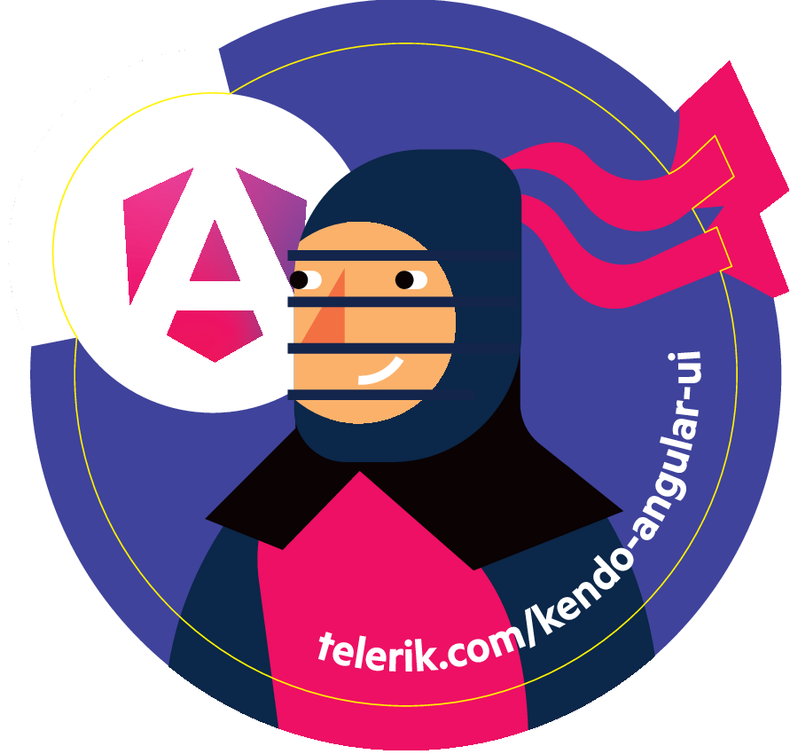

<h1 align="center">KendoReact</h1>

  

  <strong>Build modern React applications with enterprise-grade UI components.</strong>

  This is the official GitHub repository for <strong>KendoReact</strong>, serving as the central hub for bug reports, sample applications, integration demos, and community resources.

---

## Repository Overview

This repository is the official GitHub home for **KendoReact**.

Here you can:

* 🐞 Report bugs and track issues
* 📂 Explore sample applications and integration demos
* 🚀 Browse standalone examples
* 💬 Find support resources and community channels
* 📖 Access the latest product documentation and roadmap

> [!NOTE]
> This repository **does not contain the source code** of the KendoReact components. It provides issue tracking, sample projects, documentation resources, and community support.

---

## 🚀 Quick Links

| 📖 Learn | 🆘 Get Help | 🐞 Report & Track | 🔍 Explore |
| :--- | :--- | :--- | :--- |
| <a href="https://www.telerik.com/kendo-react-ui/components/getting-started" target="_blank">Getting Started</a> | <a href="https://www.telerik.com/account/support-tickets" target="_blank">Open a Support Ticket</a> | <a href="https://github.com/telerik/kendo-react/issues" target="_blank">Open a Bug</a> | <a href="https://github.com/telerik/kendo-react/tree/update-readme/docs" target="_blank">Docs Examples</a> |
| <a href="https://www.telerik.com/kendo-react-ui/components/" target="_blank">Components List</a> | <a href="https://www.telerik.com/forums/kendo-ui-react" target="_blank">Ask on the Forums</a> | <a href="https://github.com/telerik/kendo-react/issues?q=is%3Aissue+is%3Aclosed" target="_blank">Search Closed Issues</a> | <a href="https://github.com/telerik/kendo-react/tree/master/examples" target="_blank">Sample Projects</a> |
| <a href="https://www.telerik.com/kendo-react-ui/components/faq/" target="_blank">Browse the FAQ</a> | <a href="https://stackoverflow.com/questions/tagged/kendo-react-ui" target="_blank">Ask on Stack Overflow</a> | <a href="https://feedback.telerik.com/kendo-react-ui" target="_blank">Open a Feature Request</a> | <a href="https://www.telerik.com/support/whats-new/kendo-react-ui/roadmap" target="_blank">See the Roadmap</a> |
---

# 🐞 Reporting Bugs

Before opening a new issue, please:

* Search the existing <a href="https://github.com/telerik/kendo-react/issues" target="_blank">GitHub Issues</a>
* Check whether the issue has already been resolved in the <a href="https://github.com/telerik/kendo-react/issues?q=is%3Aissue+is%3Aclosed" target="_blank">Closed Issues</a>
* Create a minimal reproducible example using <a href="https://stackblitz.com" target="_blank">StackBlitz</a>

When submitting a bug report, include:

* A runnable StackBlitz reproduction
* React version
* KendoReact version
* Browser and operating system
* Steps to reproduce
* Expected behavior
* Actual behavior

> [!TIP]
> Issues that include a runnable StackBlitz example can usually be investigated much faster.

---

# 📚 Documentation & Live Examples

This repository includes the complete documentation and interactive examples used on the official KendoReact website:

* **<a href="https://github.com/telerik/kendo-react/tree/update-readme/docs" target="_blank">Documentation</a>** — Full component reference, guides, and API documentation
* **<a href="https://github.com/telerik/kendo-react/tree/update-readme/docs/content" target="_blank">Interactive Examples</a>** — Runnable component demos and code samples
* **<a href="https://github.com/telerik/kendo-react/tree/master/examples" target="_blank">Sample Applications</a>** — Complete projects demonstrating real-world usage patterns

Clone the repository and run the documentation locally to explore all examples and patterns.

---

# 📂 Sample Projects

This repository hosts sample applications that demonstrate the usage of KendoReact components in real-world scenarios.

### Featured Examples

| Example                                                                                                                                           | Description                    |
| :------------------------------------------------------------------------------------------------------------------------------------------------ | :----------------------------- |
| 🏥 <a href="https://github.com/telerik/kendo-react/tree/master/examples/react-health-app" target="_blank">Healthcare App</a>                                         | Healthcare management          |
| 📈 <a href="https://github.com/telerik/kendo-react/tree/master/examples/kendo-react-finance-portfolio" target="_blank">Finance Portfolio</a>                         | Financial dashboard            |
| 🛒 <a href="https://github.com/telerik/kendo-react/tree/master/examples/ecommerce-jewellery-store" target="_blank">E-Commerce Store</a>                              | E-commerce application         |
| 💰 <a href="https://github.com/telerik/kendo-react/tree/master/examples/kendo-react-personal-finance" target="_blank">Personal Finance</a>                           | Personal finance app           |
| ☕ <a href="https://github.com/telerik/kendo-react/tree/master/examples/react-coffee-warehouse" target="_blank">Coffee Warehouse</a>                                     | Complete business application  |
| 🟢 <a href="https://github.com/telerik/kendo-react/tree/master/examples/kendo-react-nextjs" target="_blank">Next.js Integration</a>                                  | Next.js SSR example            |
| 📦 <a href="https://github.com/telerik/kendo-react/tree/master/examples/kendo-react-project-tracker-app" target="_blank">Project Tracker</a>                         | Project management application |
| 💨 <a href="https://github.com/telerik/kendo-react/tree/master/examples/kendo-react-tailwind" target="_blank">Tailwind Integration</a>                               | Tailwind CSS styling           |
| 📁 <a href="https://github.com/telerik/kendo-react/tree/master/examples/kendo-react-file-manager" target="_blank">File Manager</a>                                   | File management UI             |
| 🤖 <a href="https://github.com/telerik/kendo-react/tree/master/examples/ai-usage-monitoring-dashboard" target="_blank">AI Usage Monitor</a>                          | AI metrics dashboard           |
| ⚡ <a href="https://github.com/telerik/kendo-react/tree/master/examples/kendo-react-grid-performance" target="_blank">Grid Performance</a>                               | Performance optimization       |
| 📊 <a href="https://github.com/telerik/kendo-react/tree/master/examples/kendo-react-sales-dashboard" target="_blank">Sales Dashboard</a>                             | Admin dashboard                |

Explore all <a href="https://github.com/telerik/kendo-react/tree/master/examples" target="_blank">sample applications</a>.

---

# 💬 Getting Support

All documentation, troubleshooting guides, forums, and support channels are listed in the <a href="#-quick-links" target="_blank">Quick Links</a> table above.

Need custom development or architecture assistance?

The <a href="https://www.progress.com/services" target="_blank">Progress Services</a> team can help with custom implementations, migrations, consulting, and full application development.

---

# 💡 Feature Requests

Help shape the future of KendoReact.

* Use the <a href="https://feedback.telerik.com/kendo-react-ui" target="_blank">Feedback Portal</a> to vote on ideas and submit new requests
* <a href="https://www.telerik.com/account/support-center/contact-us/technical-support" target="_blank">Contact our support team</a> if you have concerns, questions, or need further clarifications

---

# 🔐 Licensing

KendoReact offers both **free** and **commercial** components.

* **Free Components** — A selection of components available at no cost. Paid ones are indicated with a **Premium** tag in the documentation.
* **Commercial Components** — The full suite requires a valid license for production use.

Get started with:

* <a href="https://www.telerik.com/try/kendo-react-ui" target="_blank">Free Trial</a>
* <a href="https://www.telerik.com/purchase/kendo-ui" target="_blank">Purchase a License</a>
* <a href="https://www.telerik.com/kendo-react-ui/components/my-license/" target="_blank">License Activation Guide</a>

Additional information:

* <a href="https://www.telerik.com/purchase/license-agreement/progress-kendoreact" target="_blank">Telerik End User License Agreement</a>

---

## 🌐 Explore More Kendo UI Products

<table>
<tr>
<td align="center" width="50%">

<a href="https://github.com/telerik/kendo-angular">

### Kendo UI for Angular
</a>

</td>
<td align="center" width="50%">
<a href="https://github.com/telerik/kendo-vue">

### Kendo UI for Vue

</a>

</td>
</tr>
</table>

---

### Stay Connected

