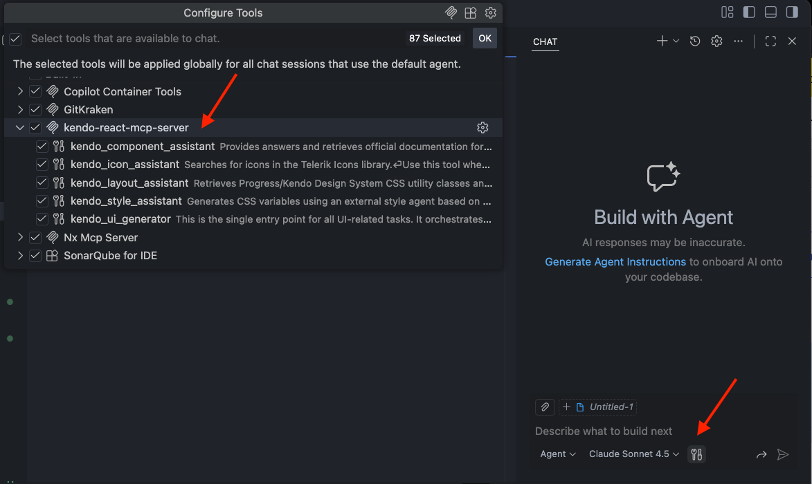
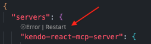

# Troubleshooting

This article provides solutions to common issues you may encounter when working with the KendoReact AI Tools.

## AI Coding Assistant Stopped Working

Starting in February 2026, we restructured the KendoReact AI Tools to better serve different user needs by deprecating the AI Coding Assistant. The KendoReact MCP server now provides a single workflow centered around the Agentic UI Generator tool and its specialized MCP assistants.

As part of this restructuring, license requirements have also changed.

-   **All active Telerik subscription licenses**&mdash;Provide access to the Agentic UI Generator.
-   **Trial licenses**&mdash;Provide access during the active trial period.
-   **Perpetual licenses**&mdash;Do not grant access to the AI tools. You must have an active Subscription or trial license to use the KendoReact MCP server.

> Telerik Subscription licenses were introduced in 2025 and they explicitly contain the word "Subscription" in their name, for example:
>
> -   DevCraft Ultimate Subscription
> -   DevCraft Complete Subscription
> -   DevCraft UI Subscription
> -   KendoReact Subscription
>
> An automatically renewing license is not necessarily a Subscription license. The following licenses are Perpetual and they use a legacy naming scheme. These are not Subscription licenses:
>
> -   DevCraft Ultimate with Subscription and Ultimate Support
> -   DevCraft Complete with Subscription and Priority Support
> -   DevCraft UI with Subscription and Lite Support

For detailed information about license requirements and tool capabilities, see [License Requirements](slug:ai_tools_overview#license-requirements).

## I Started a Trial License but Cannot Activate the MCP Server

When you activate a trial license, you must download and install the updated license key to enable access to the AI Tools. To resolve this issue:

1. [Download your trial license key](slug:my_license#download-your-license-key-file) from your Telerik account.
1. [Install or update the license key](slug:my_license#install-or-update-the-license-key-file-in-your-project) in your development environment.
1. Restart your IDE to ensure the changes take effect.
1. Start the MCP server.

The MCP server validates your license during initialization. Without a properly installed trial license key, the server cannot authenticate your access to the AI Tools.

## The MCP Server Assistants Are Not Recognized by VS Code

If the Kendo React MCP server assistants are not available or recognized by GitHub Copilot in VS Code, you may need to manually enable them:

1. In the bottom right of the Copilot chat window, click **Configure Tools**.
1. In the popup, check the **kendo-react-mcp-server** from the list to enable it.

## The MCP Server Start Button Is Missing

If the MCP server start button is not visible and displays an error message instead, this typically indicates a licensing or configuration issue.

To resolve this:

1. **Verify your license**&mdash;Ensure you have [an active Subscription or trial license](slug:ai_tools_overview#license-requirements). Perpetual licenses do not grant access to the AI Tools.
1. **Verify MCP server configuration**&mdash;Ensure the MCP server is properly configured in your VS Code settings as described in the [Installation guide](slug:agentic_ui_generator_getting_started).
1. **Restart your IDE**&mdash;Close and reopen VS Code to ensure all changes take effect.

If the issue persists after following these steps, check your license status in your Telerik account to confirm it's active and includes access to the AI Tools.

## See Also

-   [KendoReact AI Tools Overview](slug:ai_tools_overview)
-   [Installation](slug:agentic_ui_generator_getting_started)
-   [Agentic UI Generator Getting Started](slug:agentic_ui_generator_getting_started)
-   [Licensing](slug:my_license)
