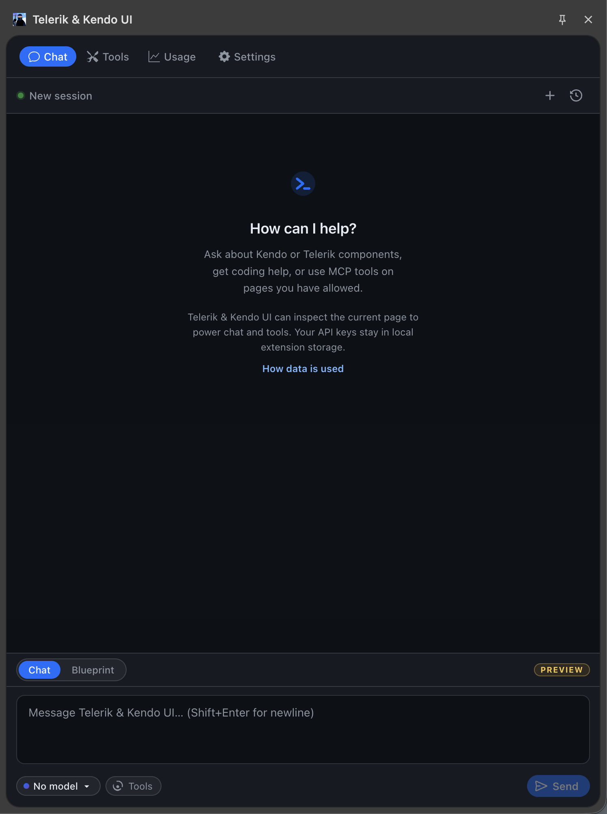

# Telerik & Kendo UI WebMCP Browser Extension

> note The Telerik & Kendo UI WebMCP browser extension is currently in **preview**. Features and behavior may change before the final release.

The Telerik & Kendo UI WebMCP browser extension provides a chat interface for interacting with AI models. It connects to all [WebMCP tools](slug:web_mcp_overview) registered on the current page and allows AI models to discover and invoke those tools through natural language conversation.

## Installation

[Install the Telerik WebMCP Browser Extension](https://chromewebstore.google.com/detail/telerik-kendo-ui/bikfklddeekcicbafiejfbbpdjnaaiid) from the Chrome Web Store.

The next required steps are to [add AI model API credentials](#api-credentials) and [allow web page access](#page-access). Here is how the running extension looks like in the browser:

## Extension Tabs

The browser extension toolbar contains four tabs:

| Tab          | Description                                                                                                    |
| ------------ | -------------------------------------------------------------------------------------------------------------- |
| **Chat**     | The main conversation interface. Send prompts and the AI model invokes WebMCP tools on the page.               |
| **Tools**    | Lists all WebMCP tools registered on the current page. View tool names, descriptions, and parameters.          |
| **Usage**    | Shows AI usage metrics, including input tokens, output tokens, and the total consumption across conversations. |
| **Settings** | Configures API credentials, prompting behavior, and page access. See [Settings](#settings).                    |

## Settings

The Settings tab is organized into three sections:

-   [API Credentials](#api-credentials)
-   [Prompting](#prompting)
-   [Page Access](#page-access)

### API Credentials

Register an AI model provider that the extension uses to process conversations and invoke tools. The following providers are supported:

-   **OpenAI**&mdash;provide your OpenAI API key and select a model.
-   **Google Gemini**&mdash;provide your Gemini API key.
-   **Anthropic**&mdash;provide your Anthropic API key.
-   **Azure OpenAI**&mdash;provide your Azure OpenAI endpoint, deployment name, and API key.

### Prompting

Set custom system instructions that are sent with every conversation. Use this to define rules specific to your application and use case.

For example, you can instruct the model to always filter the Grid before exporting, or to navigate the Scheduler to today's date before creating an event.

### Page Access

The browser extension only inspects pages and invokes tools on matching allowed origins. All other origins are denied by default. Add multiple allowed origins on separate lines.

The accepted formats are:

-   Host name with scheme: `https://example.com`
-   Bare hostname: `example.com`
-   Host with port: `localhost:3000`
-   Wildcard subdomains: `*.example.com`

## Privacy Policy

### How Telerik & Kendo UI handles data today

Telerik & Kendo UI does not currently collect analytics, telemetry, or chat data for a Telerik & Kendo UI/Telerik service. The extension runs locally in your browser and, when you use AI features, sends data directly to the model provider you configured in Settings. The sections below spell out exactly what Telerik & Kendo UI can read, what may leave the browser, and what stays stored locally.

### What Telerik & Kendo UI can read

These are the local page and tool inputs the extension may access on the active tab.

-   Telerik & Kendo UI reads the active tab title and URL locally so the extension can show which page is active. Those values are only sent to a model when you use Blueprint mode, where they are embedded in the page snapshot.
-   When you send a Blueprint request, Telerik & Kendo UI captures a sanitized snapshot of document.body. That snapshot can include truncated visible text, page structure, selected HTML attributes, up to the first 5 rows in each table body, and HTML value attributes already present in the page source.
-   When page tools are enabled, Telerik & Kendo UI can read tool names, descriptions, and JSON input schemas exposed by the current page. If a tool is invoked, Telerik & Kendo UI also reads the tool arguments and the result returned by the page.
-   Snapshot capture, tool discovery, and tool execution are limited to origins you explicitly add to the allowlist in Settings. All other origins are denied by default.

### What is sent to your provider

These are the payloads that can leave the browser when you use the configured AI provider.

-   Telerik & Kendo UI does not currently send data to a Telerik & Kendo UI/Telerik server, analytics endpoint, or any extension-run intermediary. AI requests go directly from the extension to the provider you configured in Settings: OpenAI, Azure OpenAI, Anthropic, or Google Gemini.
-   Each provider request includes the conversation messages for that turn, the selected model ID, and your configured system prompt.
-   When tools are enabled, the same provider request also includes tool names, descriptions, and JSON input schemas so the model can request a tool call.
-   Blueprint requests also include the sanitized page snapshot. Tool-enabled turns also send tool call arguments and tool results back to the same configured provider so the model can continue the turn.

### What is stored locally

These values stay in chrome.storage.local on this device unless you change or delete them.

-   chrome.storage.local stores kendo:settings with your provider configuration, API keys, system prompt, behavior settings, allowed origins, and history-retention preferences.
-   If Save history is enabled, kendo:chat-history stores conversation messages locally. If Retain tool outputs is enabled, saved conversations can also include tool call results.
-   kendo:token-usage stores aggregate token counters by provider and model. It does not store message text or API keys.
-   kendo:models-cache stores cached model metadata. For Azure OpenAI, that cache can include the configured endpoint, API version, deployment name, and validated model metadata returned by Azure.
-   kendo:beta-welcome-dismissed stores whether the one-time beta welcome notice has already been dismissed in this browser profile.

### What Telerik & Kendo UI does not collect

These are important boundaries for the current extension implementation.

-   Telerik & Kendo UI does not currently collect telemetry, analytics, crash reports, or chat transcripts for a Telerik & Kendo UI/Telerik service.
-   No page snapshots, tool results, or API keys are uploaded to a Telerik & Kendo UI/Telerik-operated backend because the extension does not use one.
-   API keys are never injected into visited pages.
-   API keys stay in extension storage and are only used by the background service worker for direct requests to the provider you selected.

## See Also

-   [WebMCP Supported Components](slug:web_mcp_supported_components)
