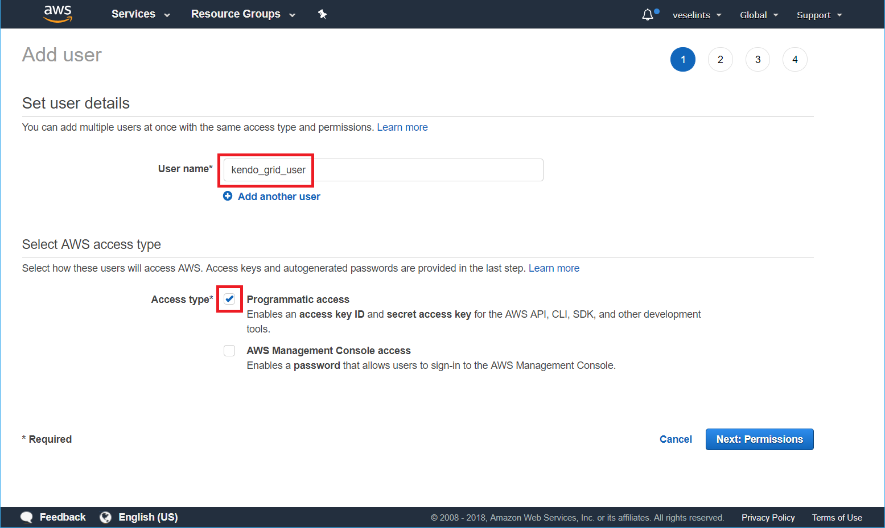
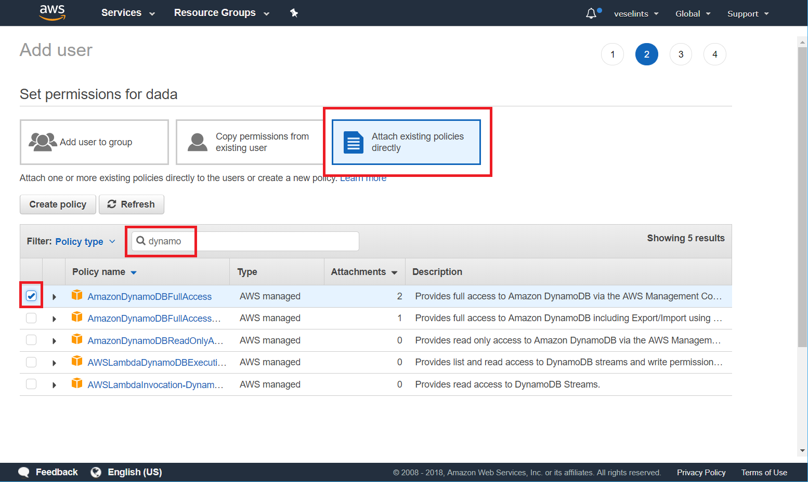
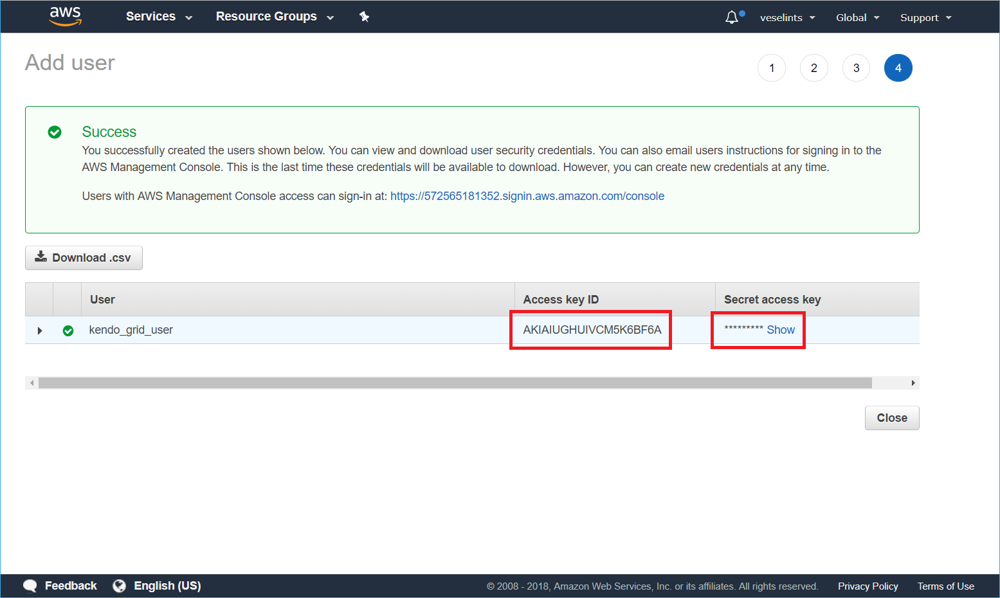

# Consuming Data from Amazon DynamoDB

This tutorial demonstrates how to create a table in [Amazon DynamoDB](https://aws.amazon.com/dynamodb/) and configure the KendoReact Grid to retrieve, create, update, and destroy items in that table.

## Prerequisites

* [Amazon AWS account](https://aws.amazon.com/account/)
* Basic knowledge on using the [AWS Console](https://console.aws.amazon.com/)

## Creating Users to Access and Manipulate the Amazon DynamoDB Table

The following instructions demonstrate how to create a user identity and use that identity directly on the client to access a DynamoDB table.

> Even though the following instructions demonstrate how to create a user identity and use that identity directly on the client to access a DynamoDB table, exposing user credentials directly on the client is not recommended. That is why, before sharing the client implementation with third parties or users, switch to the [Amazon Cognito](https://docs.aws.amazon.com/cognito/latest/developerguide/what-is-amazon-cognito.html) authentication.

1. In the [AWS Console](https://console.aws.amazon.com/), search for `"iam"` (Identity and Access Management).
1. In the IAM console, select **Users** and then **Add User**.
1. Type a user name and check the **Programmatic access** option&mdash;for example, `kendo_grid_user`. Click **Next: Permissions**.

    **Figure 1: Adding a new user**
    

1. Select **Attach existing policies directly**. In the search field, type `dynamodb` and check the **AmazonDynamoDBFullAccess** option in the table. Click **Next: Review** > **Create user**

    **Figure 2: Configuring the user permissions**
    

1. From the summary view of the newly created user, copy the **Access key ID** and the **Secret access key**.

    **Figure 3: Getting the user credentials**
    

## Installing and Configuring the AWS SDK

1. Install the [AWS SDK](https://www.npmjs.com/package/aws-sdk).
1. Import and use the AWS SDK to create the CRUD operations-related service methods.

    ```jsx
        import * as AWS from 'aws-sdk';
    ```

1. Configure the AWS authentication by using the user that is already created.

    ```jsx
        AWS.config.update({
          region: 'us-east-1',
          endpoint: 'dynamodb.us-east-1.amazonaws.com',
          accessKeyId: [the user access key ID],
          secretAccessKey: [the user secret access key]
        });
    ```

1. Initialize the AWS DynamoDB client.

    ```jsx
        this.dynamodb = new AWS.DynamoDB();
        this.docClient = new AWS.DynamoDB.DocumentClient();
    ```

## Handling the Grid CRUD Operations

> Based on the application logic, you can call all functions for loading, creating, updating, and deleting items by using the buttons inside and outside the Grid.

1. Initialize the Grid.

    ```jsx
        <Grid data={this.state.gridData}>
            // Grid columns
        </Grid>
    ```

1. Implement the `read` function to scan the DynamoDB table.

    ```jsx
        onRead = () => {
            let that = this;
            let params = {
                TableName: "Movies"
            };

            this.docClient.scan(params, function(err, data) {
            if (err) {
                console.log(err);
            } else {
                that.setState({
                    gridData: data
            })
            }
        });
    };
    ```

1. To add a new item to the table, use the `put` action. On the client and before the newly created item is sent to the server, assign a new id to the item.

    ```jsx
        оnCreate = (newItem) => {
            let that = this;
            // Assign an id to the new item
            model.id = guid(); // Use a method for creating the new id
            // The date has to be saved as an ISO string
            newItem.release_date = model.release_date.toISOString();

            let params = {
                TableName: "Movies",
                Item: newItem
            };

            this.docClient.put(params, function(err, data) {
            if (err) {
                console.log(err);
            } else {
                let gridCurrentData = that.state.gridData
                gridCurrentData.shift(newItem)
                that.setState({
                    gridData: gridCurrentData // Set the new data to the Grid if INSERT is successful
                })
            }
        });
    }
    ```

1. The `update` function alters the properties of an item and uses the `update` action with an `UpdateExpression` string.

    ```jsx
        оnUpdate = (updatedItem) => {
            let that = this;
            // The date has to be saved as an ISO string
            updatedItem.release_date = model.release_date.toISOString();

            let updateArray = [];
            let updateArrtibutes = {};

            // Get all fields and field values in the item
            for (let property in updatedItem) {
                // Skip the id field as it has to be an immutable identifier
                if (updatedItem.hasOwnProperty(property) && property != "id") {
                    updateArray.push(property + " = :" + property);
                    updateArrtibutes[":" + property] = updatedItem[property];
                }
            }

            // Generate the UpdateExpression string
            let updateExpression = "set " + updateArray.toString();

            let params = {
                TableName: "Movies",
                Key:{
                    id: model.id
                },
            UpdateExpression: updateExpression,
            ExpressionAttributeValues: updateArrtibutes,
            // Return the modified item
                ReturnValues:"ALL_NEW"
            };
            this.docClient.update(params, function(err, data) {
                if (err) {
                    console.log(err);
                } else {
                    let gridCurrentData = that.state.gridData
                    let index = gridCurrentData.findIndex(p => p === updatedItem || updatedItem.id && p.id === updatedItem.id);
                    gridCurrentData[index] = updatedItem;
                    that.setState({
                        gridData: gridCurrentData // Set the new data to the Grid if UPDATE is successful
                    })
                }
            });
        }
    ```

1. The `destroy` function uses the `delete` action and removes an item from the DynamoDB table against its id.

    ```jsx
        onDelete = (deletedItem) => {
            let that = this;
            var params = {
                TableName: "Movies",
                Key:{
                    id: deletedItem.id
                },
                ReturnValues:"ALL_OLD"
            };

            this.docClient.delete(params, function(err, data) {
                if (err) {
                    console.log(err);
                } else {
                    let gridCurrentData = that.state.gridData
                    let index = gridCurrentData.findIndex(p => p === deletedItem || deletedItem.id && p.id === deletedItem.id);
                    gridCurrentData = gridCurrentData.splice(index, 1);
                    that.setState({
                        gridData: gridCurrentData // Set the new data to the Grid if DELETE is successful
                    })
                }
            });
        }
    ```

## Suggested Links

* [Consuming Data from Azure Cosmos DB]()
* [Binding the Grid to Azure Functions]()
* [Consuming Data from Google Cloud Big Query]()
