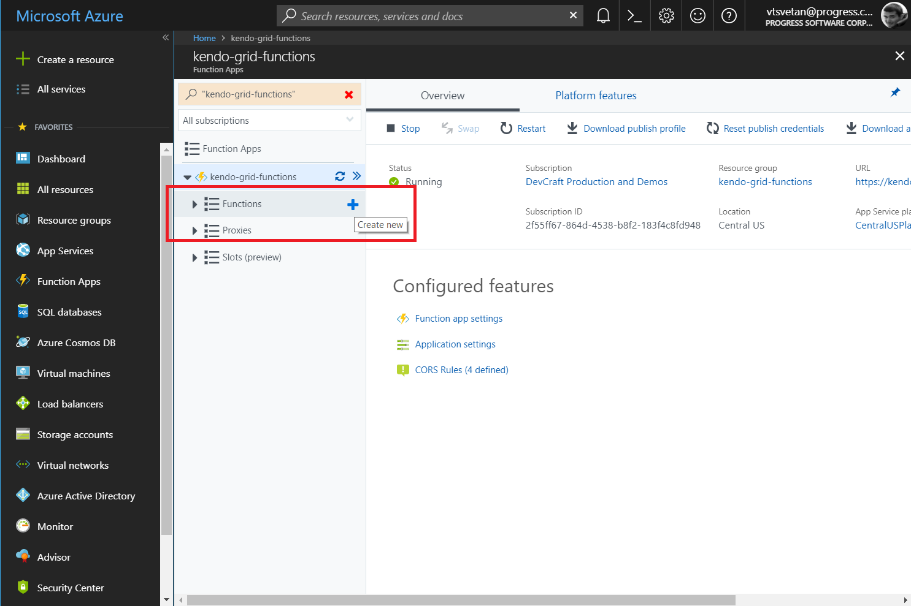
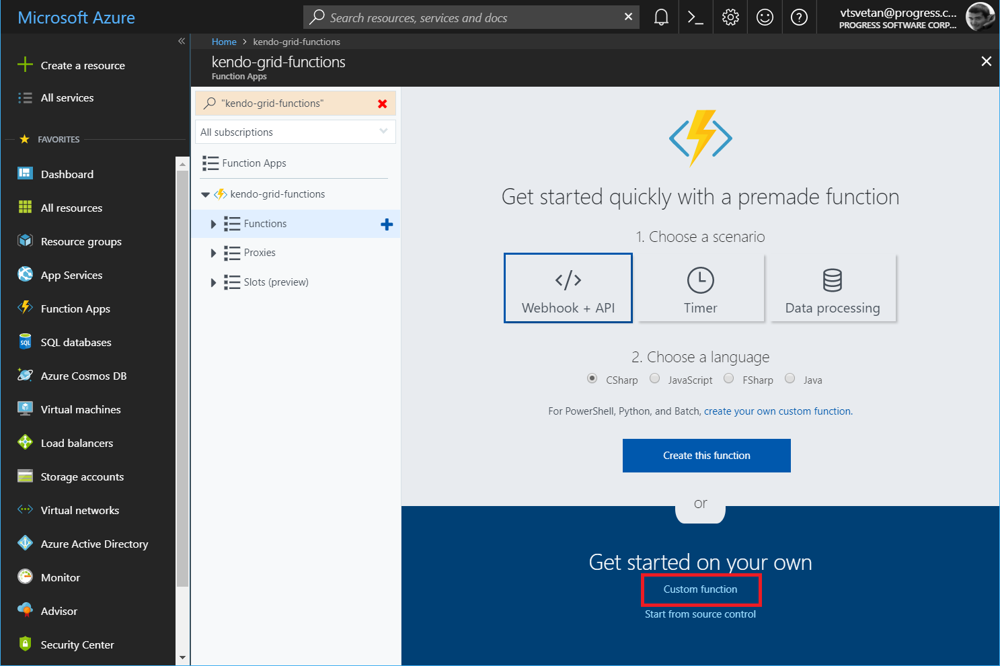
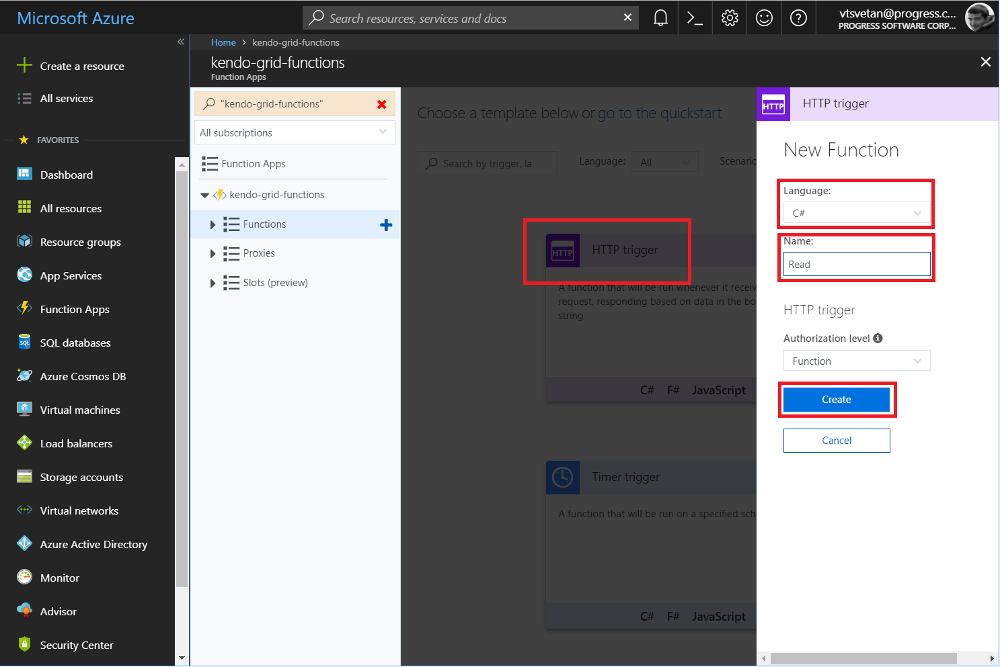
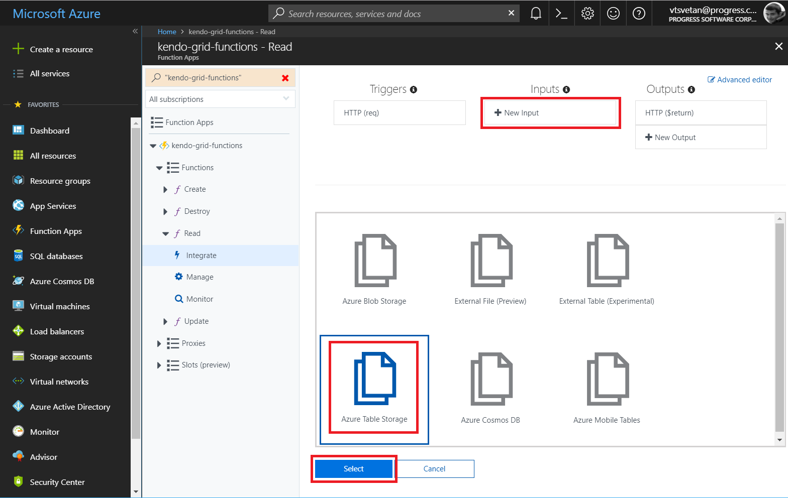
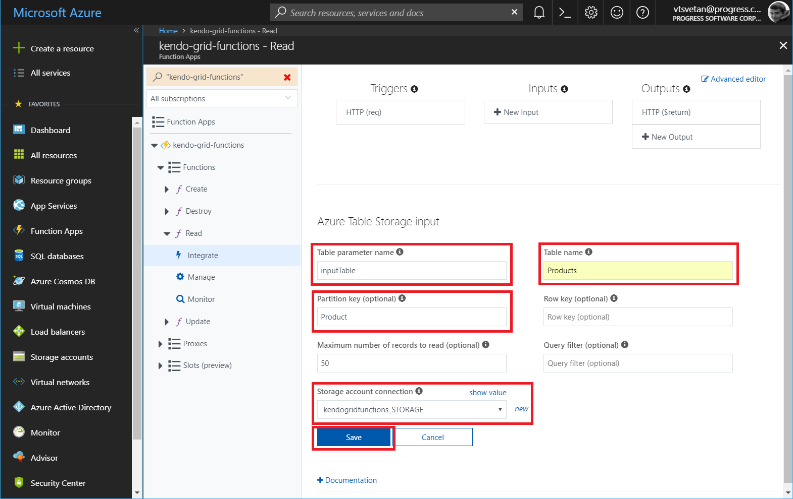
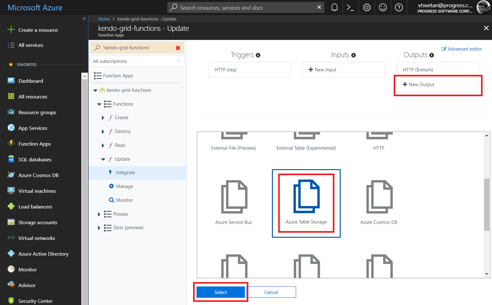
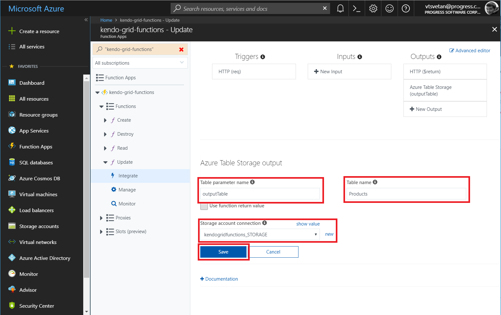
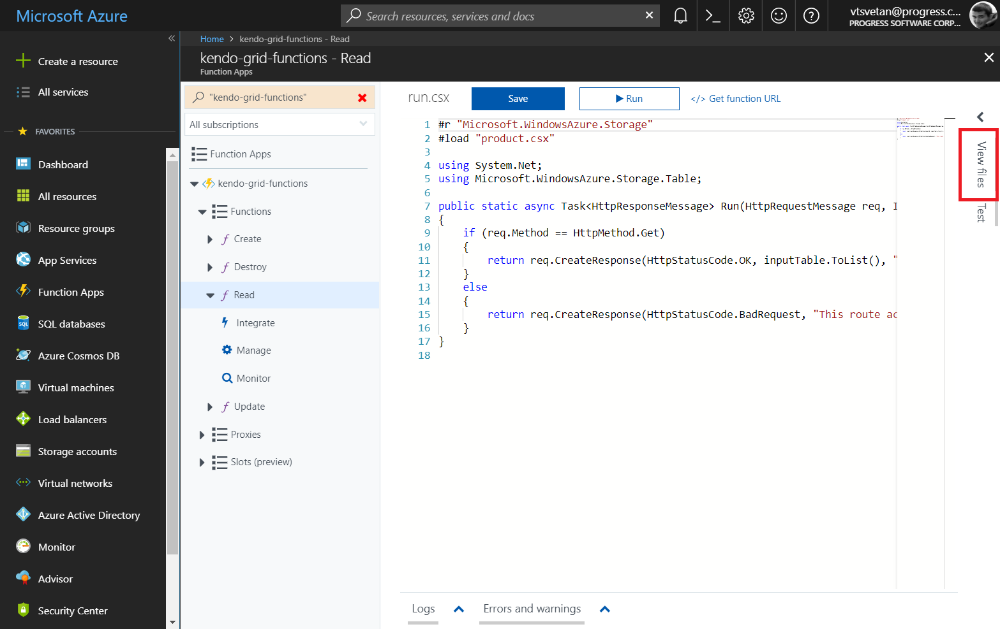
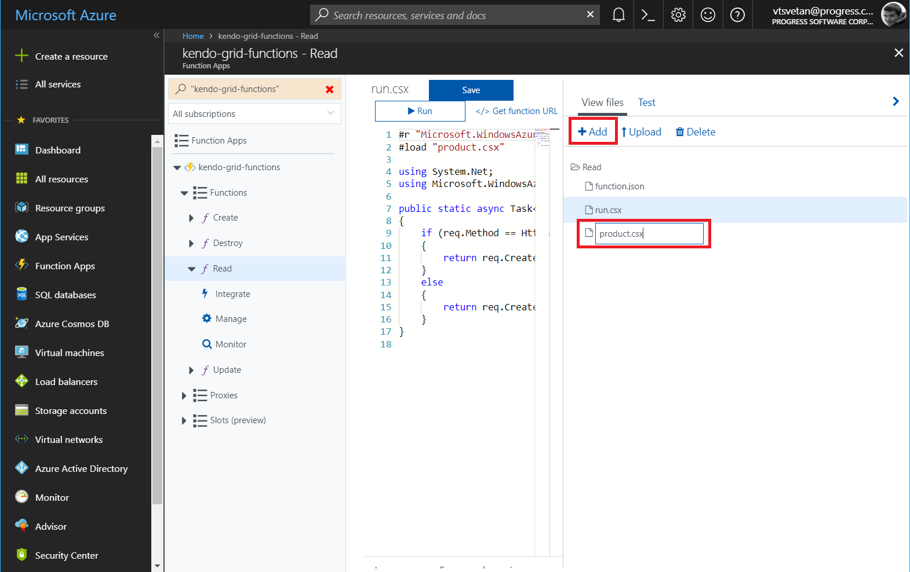
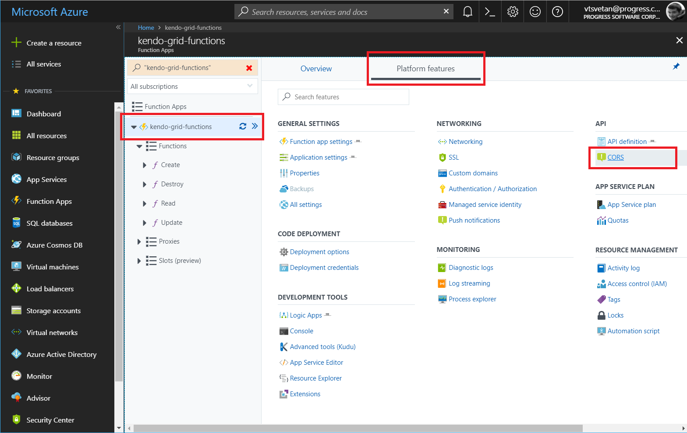

# Consuming Data from Azure Functions

This tutorial demonstrates how to configure [Azure Functions](https://docs.microsoft.com/en-us/azure/azure-functions/) to serve data to a KendoReact Grid.

## Prerequisites

* Basic knowledge on the organization of [Azure Portal](https://docs.microsoft.com/en-us/azure/azure-portal/)

## Creating Azure Functions Applications

1. Follow the [Create your first function in the Azure portal](https://docs.microsoft.com/en-us/azure/azure-functions/functions-create-first-azure-function) >  [Create a function app](https://docs.microsoft.com/en-us/azure/azure-functions/functions-create-first-azure-function#create-a-function-app) quickstart guide.
1. Provide `kendo-grid-functions` as a name to the application and set the name of the storage account to `kendogridfunctions`.
1. In [Azure Portal](https://portal.azure.com/), go to the newly created **kendo-grid-functions** application.

## Creating HTTP-Triggered Functions for CRUD Operations

To set the read, create, destroy, and update functions, apply the following steps individually to each of them.

1. On the left-side panel and under the application name, click the **\+** (plus) symbol. When the **Functions** section is hovered, the symbol appears to the right.
1. Implement the four actions in the `ItemController` which will be called by the Grid on performing CRUD operations. Provide names for the actions&mdash;for example, `KendoRead`, `KendoCreate`, `KendoUpdate`, and `KendoDestroy`.

    **Figure 1: Overview of the application functions**
    

1. If the **Get started quickly with a premade function** screen appears, click the **Custom function** link at the bottom.

    **Figure 2: The Get started quickly with a premade function window**
    

1. Click the **HTTP trigger** option. On the panel that appears to the right, select the language and fill in a meaningful name for each function. As this tutorial will later on use the **Read**, **Create**, **Update**, and **Destroy** names for the four functions and will implement the Azure Functions in C#, select the `C#` language.

    **Figure 3: Configuring a new HTTP trigger function**
    

## Integrating Input for the Read Function

1. Expand the `Read` function and, under the function name on the left navigation panel, click the **Integrate** section.
1. In the **Inputs** section, click the **New Input** button.
1. Select **Azure Table Storage** as the input storage that will be integrated. Click **Select**.

    **Figure 4: Integrating the new input for the function**
    

1. Type `Product` for the partition key of the table.
1. Choose the maximum number of records to read. In this case, the default value of 50 will be preserved.
1. In **Storage account connection** to the right of the field, click the **new** link.
1. Select the **kendogridfunctions** connection that was created during the initial setup of the application.
1. Change **Table name** to **Products**.
1. Click **Save** to save the newly integrated input table.

    **Figure 5: Configuring the new input**
    

## Integrating Output for the Create, Destroy, and Update Functions

Configure an output integration for each of the other three functions (create, destroy, and update):

1. Click **New Output**.
1. Select **Azure Table Storage** and click **Select**.

    **Figure 6: Integrating the new output for the function**
    

1. Select **kendogridfunctions_STORAGE** for the storage account connection.
1. Change **Table name** to **Products**.
1. Click **Save** to save the newly integrated output table.

    **Figure 7: Configuring the new output**
    

## Implementing the Model

The actual implementation requires you to first create a definition for the `Product` class:

1. Select the `Read` function.
1. On the right side, click **View files**.

    **Figure 8: Opening the function files**
    

1. Click the **Add** button and provide the `product.csx` name to the new file.

    **Figure 9: Creating a new function file**
    

1. Place the following class definition in the file.

    ```cs
    using Microsoft.WindowsAzure.Storage.Table;

    public class Product :TableEntity
    {
        public string ProductName { get; set; }

        public double UnitPrice { get; set; }

        public int UnitsInStock { get; set; }

        public bool Discontinued { get; set; }

        public Product ToEntity()
        {
            return new Product
            {
                PartitionKey = "Product",
                RowKey = this?.RowKey,
                ProductName = this?.ProductName,
                UnitPrice = this.UnitPrice,
                UnitsInStock = this.UnitsInStock,
                Discontinued = this.Discontinued,
                ETag = "*"
            };
        }
    }
    ```

## Implementing the Read Function

1. Under the `Read` function, open the `run.csx` file.
1. Before the initial use, include the following `load` directive that allows you to use the `Model` class definition in the actual function.

    ```cs
    #load "product.csx"
    ```

1. Include a reference to the `Microsoft.WindowsAzure.Storage` and a `using` configuration for the `Table` library.

    ```cs
    #r "Microsoft.WindowsAzure.Storage"
    …
    using Microsoft.WindowsAzure.Storage.Table;
    ```

1. Modify the definition of the `Run` function method. The newly added `inputTable` parameter allows you to get and return the products that are stored in the integrated table storage.

    ```cs
    public static async Task<HttpResponseMessage> Run(HttpRequestMessage req, IQueryable<Product> inputTable, TraceWriter log)
    {
        if (req.Method == HttpMethod.Get)
        {
            // Return the Products table as a list
            return req.CreateResponse(HttpStatusCode.OK, inputTable.ToList(), "application/json");
        }
        else
        {
            return req.CreateResponse(HttpStatusCode.BadRequest, "This route accepts only GET requests.");
        }
    }
    ```

## Implementing the Create, Destroy, and Update Functions

Now you can proceed with the implementation of the other three functions.

1. Make all three of them load the `Product` class and refer the `Microsoft.WindowsAzure.Storage` and `Newtonsoft.Json` assemblies.
1. Add the respective `using` configurations. As a result, the `Run` methods for each function differ.

    ```cs
    #r "Newtonsoft.Json"
    #r "Microsoft.WindowsAzure.Storage"
    #load "..\Read\product.csx"

    using System.Net;
    using Microsoft.WindowsAzure.Storage.Table;
    using Newtonsoft.Json;
    ```

The following example demonstrates the `Run` method for the `Create` function.

```cs
public static async Task<HttpResponseMessage> Run(HttpRequestMessage req, CloudTable outputTable, TraceWriter log)
{
    dynamic body = await req.Content.ReadAsStringAsync();
    Product data = JsonConvert.DeserializeObject<Product>(body as string);
    Product entity = data.ToEntity();
    string newKey = Guid.NewGuid().ToString();

    entity.RowKey = newKey;
    var operation = TableOperation.Insert(entity);
    await outputTable.ExecuteAsync(operation);

    return req.CreateResponse(HttpStatusCode.OK, entity, "application/json");
}
```

The following example demonstrates the `Run` method for the `Destroy` function.

```cs
public static async Task<HttpResponseMessage> Run(HttpRequestMessage req, CloudTable outputTable, TraceWriter log)
{
    dynamic body = await req.Content.ReadAsStringAsync();
    Product data = JsonConvert.DeserializeObject<Product>(body as string);
    Product entity = data.ToEntity();

    var operation = TableOperation.Delete(entity);
    await outputTable.ExecuteAsync(operation);

    return req.CreateResponse(HttpStatusCode.OK, entity, "application/json");
}
```

The following example demonstrates the `Run` method for the `Update` function.

```cs
public static async Task<HttpResponseMessage> Run(HttpRequestMessage req, CloudTable outputTable, TraceWriter log)
{
    dynamic body = await req.Content.ReadAsStringAsync();
    Product data = JsonConvert.DeserializeObject<Product>(body as string);
    Product entity = data.ToEntity();

    var operation = TableOperation.Replace(entity);
    await outputTable.ExecuteAsync(operation);

    return req.CreateResponse(HttpStatusCode.OK, entity, "application/json");
}
```

## Configuring the Application

As the implementation is already in place, now you need to add specific configurations to the application and for each of the four functions.

1. Click the application name and select **Platform features**.
1. Under the **API** section, click **CORS**.

    **Figure 10: The platform features of the application**
    

1. Add the domain origin of the client-side application that will consume the functions data. Click **Save**.
1. Go to the `Read` function and open the `function.json` file.
1. In the **bindings / methods section**, remove **post** as an option.
1. Open the same file for the other three functions. Remove the `get` method.

## Consuming the Implemented CRUD Endpoints on the Client

> Based on the application logic, you can call all functions for loading, creating, updating, and deleting items by using the buttons inside and outside the Grid.

1. Set `functionUlr` and the function code.

    ```jsx
        // Change https://your-application-name.azurewebsites.net/ to the base function URL of your application
        this.functionUrl = "https://your-application-name.azurewebsites.net/api/?code:XXX";
        this.code = "XXXX";
    ```

1. Bind the Grid to a `state` value.

    ```jsx
        <Grid data={this.state.gridData}></Grid>
    ```

1. Load data by making a `get` request to the `Read` function.

    ```jsx
        loadData = () => {
            let that = this
            fetch(`${that.functionUrl}READ?code=/${that.code}`)
                .then(function(response) {
                    return response.json();
                })
                .then(function(myJson) {
                    that.setState({
                        gridData: myJson
                    })
                });
        }
    ```

1. Create new items by making a request to the `Create` function.

    ```jsx
        loadData = () => {
            let that = this
            fetch(`${that.functionUrl}READ?code=/${that.code}`)
                .then(function(response) {
                    return response.json();
                })
                .then(function(myJson) {
                    that.setState({
                        gridData: myJson
                    })
                });
        }
    ```

1. Create new items by making a request to the Create function.

    ```jsx
        addRecord = (newItem) => {
            let that = this;
            fetch(`${that.functionUrl}CREATE?code=/${that.code}`, {
                method: 'post',
                body: JSON.stringify(newItem)
            }).then(function(response) {
                return response.json();
            }).then(function(createdRecord) {
                let gridCurrentData = that.state.gridData
                gridCurrentData.shift(createdRecord)
                that.setState({
                    gridData: gridCurrentData // Set the new data to the Grid if CREATE is successful
                })
            });
        }
    ```

1. Update items by making a request to the `Update` function.

    ```jsx
        updateRecord = (updatedItem) => {
            let that = this;
            fetch(`${that.functionUrl}UPDATE?code=/${that.code}`, {
                method: 'post',
                body: JSON.stringify(updatedItem)
            }).then(function(response) {
                return response.json();
            }).then(function(updatedRecord) {
                    let gridCurrentData = that.state.gridData
                    let index = gridCurrentData.findIndex(p => p === updatedRecord || updatedRecord.id && p.id === updatedRecord.id);
                    gridCurrentData[index] = updatedRecord;
                    that.setState({
                        gridData: gridCurrentData // Set the new data to the Grid if UPDATE is successful
                    })
            });
        }
    ```

1. Delete items by making a request to the `Destroy` action.

    ```jsx
            deleteRecord = (deletedItem) => {
            let that = this;
            fetch(`${that.functionUrl}DESTROY?code=/${that.code}`, {
                method: 'post',
                body: JSON.stringify(deletedItem)
            }).then(function(response) {
                return response.json();
            }).then(function(deletedRecord) {
                let gridCurrentData = that.state.gridData
                let index = gridCurrentData.findIndex(p => p === deletedRecord || deletedRecord.id && p.id === deletedRecord.id);
                gridCurrentData = gridCurrentData.splice(index, 1);
                that.setState({
                    gridData: gridCurrentData // Set the new data to the Grid if DESTROY is successful
                })
            });
        }
    ```

## Suggested Links

* [Consuming Data from Azure Cosmos DB]()
* [Consuming Data from Amazon Dynamo DB]()
* [Consuming Data from Google Cloud Big Query]()
