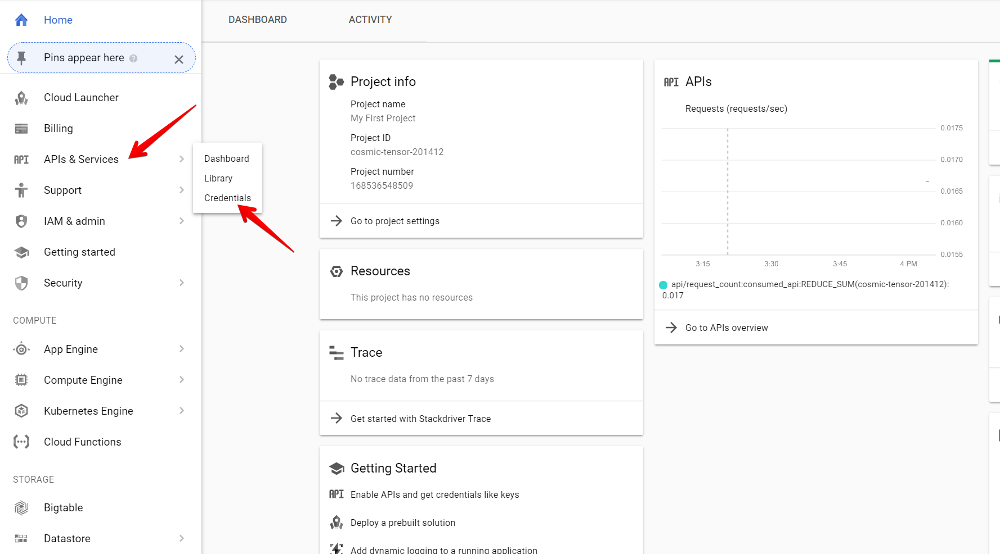
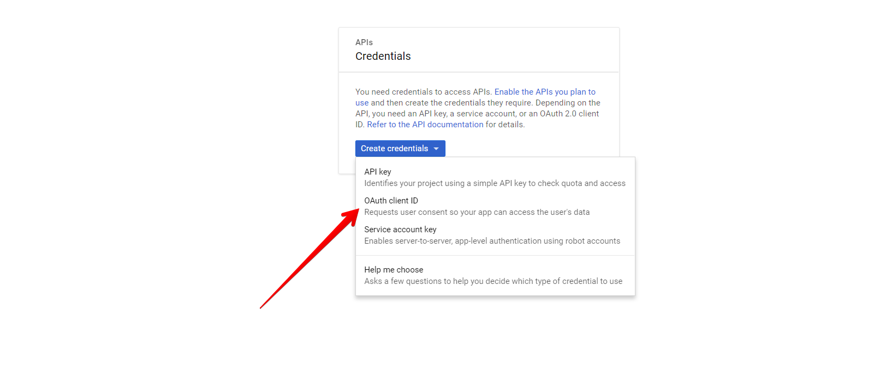
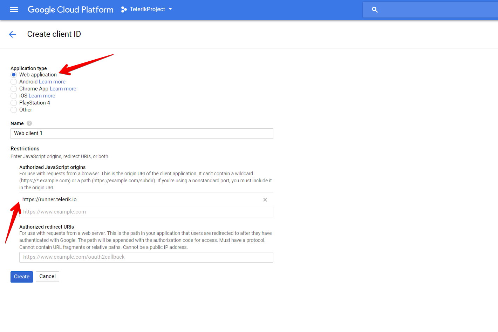
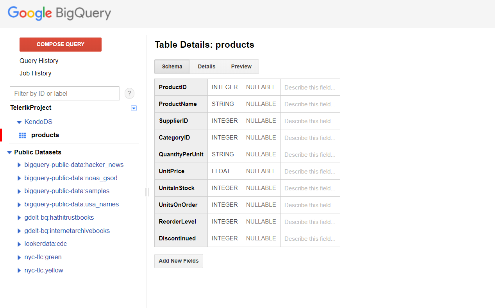
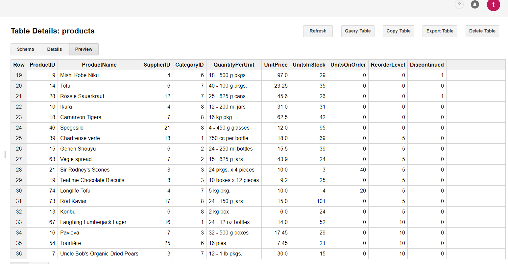

# Consuming Data from Google Cloud Big Query

This tutorial demonstrates how to create a table in [Google Cloud Big Query](https://cloud.google.com/bigquery/) and configure the KendoReact Grid to retrieve, create, update, and destroy items in that table.

## Prerequisites

* [Google Cloud account](https://cloud.google.com/)
* Basic knowledge on using the [Cloud Console](https://cloud.google.com/cloud-console/)

## Client-Side Authorization and Access through OAuth 2.0

The Google APIs Client library for JavaScript handles the client-side authorization flow for storing and using OAuth 2.0 access and refresh tokens. When you authorize access to a Google API, you receive an access token for making calls to the API. The Google API OAuth 2.0 access tokens last one hour. You can request and store a refresh token which will allow you to request a new access token when the previous access token expires. For more information on how to set up the authorization, refer to the article on [authorizing API requests](https://cloud.google.com/bigquery/docs/authorization).

To create OAuth 2.0 credentials and add authorized JavaScript origin:

1. On the left-hand side pane in the console, hover over the **APIs and Services** item and select **Credentials**.

    **Figure 1: Navigating to the Credentials section**
    

1. Click the **Create Credentials** button and select **OAuth client ID**.

    **Figure 2: Creating OAuth client ID**
    

1. Select **Web Application** and add **Authorized JavaScript origins**.

    **Figure 3: Adding the authorized origin for your application**
    

## Creating New DataSet and Table in BigQuery

For more information on how to create new DataSets and tables, refer to the articles about [creating and using DataSets](https://cloud.google.com/bigquery/docs/tables) and [creating and using tables](https://cloud.google.com/bigquery/docs/tables) from the official BigQuery documentation. For the purposes of this sample project, create a **Products** table with the following schema and data.

**Figure 4: Schema of the Products Table in the KendoDS DataSet**


**Figure 5: Data of the Products Table in the KendoDS DataSet**


## Configuring the Grid to Consume and Manipulate Available BigQuery Data

> Based on the application logic, you can call all functions for loading, creating, updating, and deleting items by using the buttons inside and outside the Grid.

1. Load the BigQuery scripts inside the project that will provide an API for consuming the Google Cloud tables.

    ```html
      <script src="https://apis.google.com/js/api.js"></script>
    ```

1. Initialize the Gapi client.

    ```jsx
      componentDidMount() {
        let that = this
        window.gapi.load("client:auth2", function () {
            window.gapi.auth2.init({client_id: that.client_id});
        });
      }
    ```

1. Authenticate the client.

    ```jsx
      authenticate = () => {
        let that = this
        window.gapi.auth2.getAuthInstance()
          .signIn({
            scope: "https://www.googleapis.com/auth/bigquery https://www.googleapis.com/auth/cloud-p" +
                "latform https://www.googleapis.com/auth/cloud-platform.read-only"
          })
          .then(function () {
            that.loadClient()
          }, function (err) {
            console.error("Error signing in", err);
          });
      }
    ```

1. Load the client.

    ```jsx
        loadClient = () => {
        let that = this
        window.gapi.client.load("https://content.googleapis.com/discovery/v1/apis/bigquery/v2/rest")
          .then(function () {
            that.loadData()
          }, function (err) {
            console.error("Error loading GAPI client for API", err);
          });
      }
    ```

1. Load the data and set it to the `state` variable to which the Grid is bound.

    ```jsx
        loadData = () => {
        let that = this
        window.gapi.client.bigquery.jobs.query({'projectId': that.project_id, 'query': 'SELECT * FROM [data base name]'})
          .then(function (response) {
            let gridData = [];
            response.result.rows.forEach(function(element) {
              let productid = element.f[0].v;
              let productname = element.f[1].v;
              let unitsinstock = element.f[6].v;
              let unitprice = element.f[5].v;
              gridData.push({productid: productid, productname: productname, unitsinstock: unitsinstock, unitprice: unitprice});
            });
            that.setState({
              gridData: gridData // Provides the data to the Grid
            })
          }, function (err) {
            console.error("Execute error", err);
          });
      }
    ```

1. Add a new item.

    ```jsx
        create = (newItem) => {
        let that = this
        let dataItem = newItem // The value of the new item

        let productid = dataItem.productid;
        let productname = '"' + options.data.productname + '"';
        let unitsinstock = options.data.unitsinstock;
        let unitprice = options.data.unitprice;

        window.gapi.client.bigquery.jobs.query({
                'projectId': project_id,
                "useLegacySql": false,
                "query": "INSERT [data base name] (ProductID, ProductName, UnitsInStock, UnitPrice) VALUES(" + productid + ", " + productname + ", " + unitsinstock + ", " + unitprice + ");"
            })
            .then(function(response) {
                    let gridCurrentData = that.state.gridData
                    gridCurrentData.shift(dataItem)
                    that.setState({
                        gridData: gridCurrentData // Set the new data to the Grid if INSERT is successful
                    })
                },
                function(err) {
                    console.error("Execute error", err);
            });
        }
    ```

1. Edit an existing item.

    ```jsx
        update = (editItem) => {
            let that = this
            let productid = editItem.productid;
            let productname = '"' + options.data.productname + '"';
            let unitsinstock = options.data.unitsinstock;
            let unitprice = options.data.unitprice;

            window.gapi.client.bigquery.jobs.query({
                "projectId": project_id,
                "useLegacySql": false,
                "query": "UPDATE [data base name] SET ProductName = " + productname + " , UnitsInStock = " + unitsinstock + ", UnitPrice = " + unitprice + " WHERE ProductID = " + productid + ";"
            })
            .then(function(response) {
                let gridCurrentData = that.state.gridData
                let index = gridCurrentData.findIndex(p => p === editItem || editItem.productid && p.productid === editItem.productid);
                gridCurrentData[index] = editItem;
                that.setState({
                    gridData: gridCurrentData // Set the new data to the Grid if UPDATE is successful
                })
            },
            function(err) {
                    console.error("Execute error", err);
            });
    }
    ```

1. Delete an existing item.

    ```jsx
        delete = (deleteItem) = {
        let that = this
        var productid = deleteItem.productid;
        window.gapi.client.bigquery.jobs.query({
            'projectId': project_id,
            "useLegacySql": false,
            'query': "DELETE KendoDS.products WHERE ProductID = " + productid + ";"
        })
        .then(function(response) {
            let gridCurrentData = that.state.gridData
            let index = gridCurrentData.findIndex(p => p === deleteItem || deleteItem.productid && p.productid === deleteItem.productid);
            gridCurrentData = gridCurrentData.splice(index, 1);
            that.setState({
                gridData: gridCurrentData // Set the new data to the Grid if DELETE is successful
            })
        },
        function(err) {
            console.error("Execute error", err);
        });
    }
    ```

## Suggested Links

* [Consuming Data from Azure Cosmos DB]()
* [Consuming Data from Amazon Dynamo DB]()
* [Binding the Grid to Azure Functions]()
