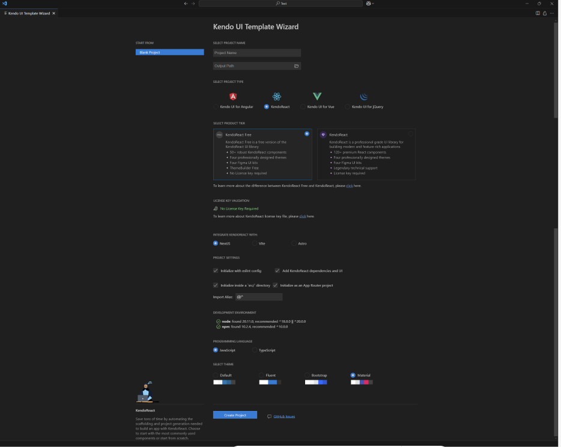
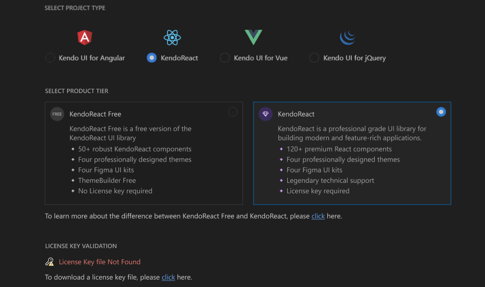
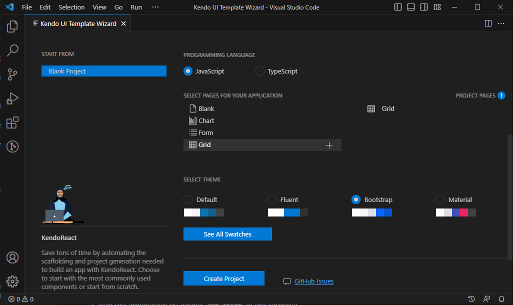
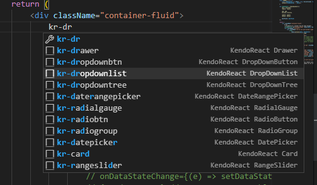
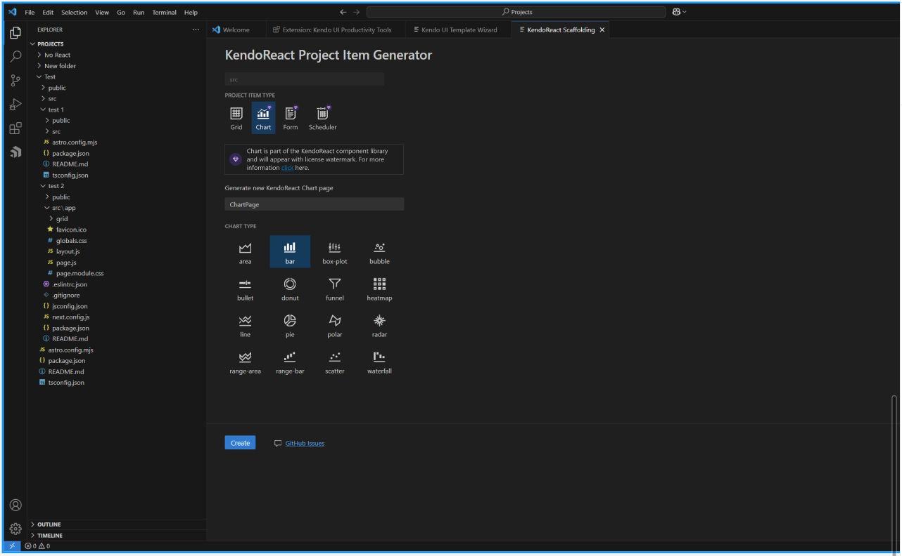

# Using with VSCode Extension

You can easily start a new project with KendoReact components by using the Kendo UI Productivity Tools Extension for Visual Studio (VS) Code.

## Prerequisites

-   React 18 (or a version >= 16.8.x)
-   [NodeJS LTS](https://nodejs.org/en) (or a version >= 14). Use the `node -v` command to check your node versions.
-   Visual Studio Code.

## Install VS Code Extensions

You can install the Kendo UI Productivity Tools extension for Visual Studio Code through:

-   The [Visual Studio Marketplace](https://marketplace.visualstudio.com/items?itemName=KendoUI.kendotemplatewizard).

-   The **Extensions** tab in Visual Studio Code:

    1. Search for **Kendo UI Productivity Tools**.
    2. Select the extension from the results list.
    3. Click the **Install** button.

    

## Create a New Project Using the Grid Template Wizard for VS Code

The **Template Wizard** provides pre-built templates to easily set up React applications using **KendoReact components**. Follow the steps below to create a new project with a **Grid template**:

1. Open the **VS Code Command Palette** (`Ctrl + Shift + P` for Windows and `Command + Shift + P` for Mac).
2. Type **"Kendo UI Template Wizard"** and select it.
3. Choose **KendoReact** as the project type.

    

4. **Select the product tier**:
    - **KendoReact Free** _(50+ free components, no signup or license required)_.
    - **KendoReact (premium)** _(120+ components, requires a license)_.

If you select the KendoReact (premium) tier, a valid license key will be required to unlock all premium components and features.



> You can switch to the premium version directly from the extension by providing a license key file (trial or paid).

5. Set the **project name** and **path**.
6. In the **Programming Language** section, select `JavaScript` or `TypeScript`.
7. Add a **Grid** [template](#toc-available-templates) from the **Select pages for your application** section.
8. In the final step, you will have the option to select one of the [supported KendoReact themes]() and start your application with it. We will choose `Bootstrap` for our sample project.

9. Click the **Create Project** button to finish the setup.

    

10. Install the **NPM dependencies**:
    ```sh
    npm i
    ```
11. Run the application:
    ```sh
    npm start
    ```
12. Navigate to `http://localhost:3000/grid` to view the **KendoReact Grid page**.

## Use a Code Snippet to Add a DropDownList to the Project

The Kendo UI Productivity Tools extension for Visual Studio (VS) Code provides a set of code snippets allowing you to add the components directly to the source code of your project.

Following the steps below, we will add a [DropDownList]() component just above the Grid in the already created project:

1. Open the `src/components/Grid.jsx` file in the created project and click just after the `<div className="container-fluid">` tag.
2. Type the `kr-` snippet prefix to show the available KendoReact snippets
3. Navigate to the `kr-dropdownlist` snippet and press `Enter`
   
4. Make sure that the `DropDownList` component is imported on the page:
    ```jsx
    import { DropDownList } from '@progress/kendo-react-dropdowns';
    ```
5. Use the `data` prop to bind the inserted DropDownList to the already defined `data` object set its `textField` prop to `ProductName`:

```jsx
<DropDownList data={data} textField="ProductName" />
```

You can see a full list with the code snippets available in the Kendo UI Productivity Tools extension for VS Code [here](#toc-code-snippets-library).

### **Available Scaffolded Components (Free vs. Premium)**

The following components can be generated using the **Scaffolding Tool**:

| Component               | Free | Premium |
| ----------------------- | ---- | ------- |
| Grid (Free Features)    | Yes  | No      |
| Grid (Premium Features) | No   | Yes     |
| Form                    | No   | Yes     |
| Chart                   | No   | Yes     |
| Scheduler               | No   | Yes     |

## Generate a Bar Chart by Scaffolding

Utilizing the Scaffolders functionality of the Kendo UI Productivity Tools extension for Visual Studio (VS) Code you can also generate complex KendoReact components from an interactive wizard-like user interface.

In this section you will see how to scaffold a KendoReact Bar Chart component to an existing React project. To do so:

1. Open the created `MyTemplateProject` project in VS Code and right-click on a the `src/components` folder on the project tree.
2. Select the **New KendoReact Project Item** option which will open the **KendoReact Scaffolding** tab.
3. In the loaded **Item Generator** set the **Project Item Type** to `Chart`, choose a name of the page and select `bar` for **Chart Type**.

 4. Click the **Create** button to generate the `Bar Chart` component.

The result will be similar to:

```jsx
import * as React from 'react';
import { Chart, ChartSeries, ChartSeriesItem } from '@progress/kendo-react-charts';

const data = [1, 2, 3, 5, 8, 13];

const ChartPageComponent = (props) => {
    return (
        <Chart>
            <ChartSeries>
                <ChartSeriesItem data={data} name="Fibonacci" />
            </ChartSeries>
        </Chart>
    );
};

export default ChartPageComponent;
```

1. Navigate to <http://localhost:3000/chartPage> to see the added KendoReact Chart component.

## Activating Your License Key (Not Needed for Free Components)

For information on activating your license, see the [Set Up Your KendoReact License Key](slug:my_license) page.

## Suggested Links

-   [Getting Started with KendoReact]()
-   [Get Started with KendoReact Free](slug://free_components_introduction)
-   [React Official Documentation](https://react.dev/learn)
-   [Productivity Tools VS Code Template Project Wizard]()
-   [Productivity Tools VS Code for Code Snippets]()
-   [Productivity Tools VS Code Scaffolders]()
