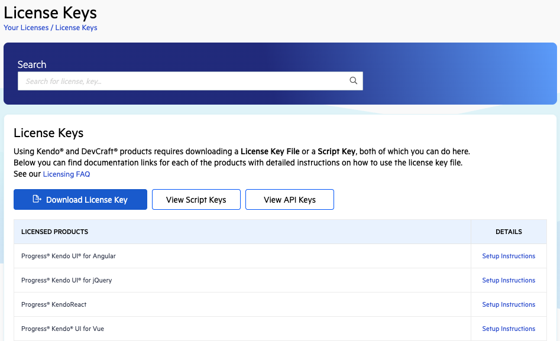

## Environment

<table>
    <tbody>
        <tr>
        	<td>Product</td>
        	<td>KendoReact</td>
        </tr>
        <tr>
        	<td>Version</td>
        	<td>Q1 2025 and later</td>
        </tr>
    </tbody>
</table>

## Description

How do I manually download my personal license key file for KendoReact from telerik.com using the browser?

## Solution

To download your license key file:

1. Verify that you have an active commercial or trial license under [Your Licenses](https://www.telerik.com/account/your-licenses) in your Telerik account.
    > If you are new to KendoReact, you can [sign up for a free trial](https://www.telerik.com/try/kendo-react-ui) or [purchase a license](https://www.telerik.com/purchase/kendo-ui).
2. Go to the [License Keys](https://www.telerik.com/account/your-licenses/license-keys) page in your Telerik account.
3. Click **Download License Key** in the **License Keys** section.

 

4. [Activate the KendoReact components](slug:my_license) by using the downloaded license key file.

> Starting with the 2025 Q1 release, the name of the downloaded file changes from `kendo-ui-license.txt` to `telerik-license.txt`. This change is required as all Telerik UI and Kendo UI products now use the same licensing mechanism with a common license key. See the [Handling License Key File Name and Environment Variable Name Changes in the 2025 Q1 Release](slug:handling_license_file_name_changes) knowledge base article for more details.

## See Also

-   [Setting Up Your License Key](slug:my_license)
-   [License Activation Errors and Warnings](slug:license_activation_errors)
-   [Frequently Asked Questions about Your KendoReact License Key](slug:faq_license)
