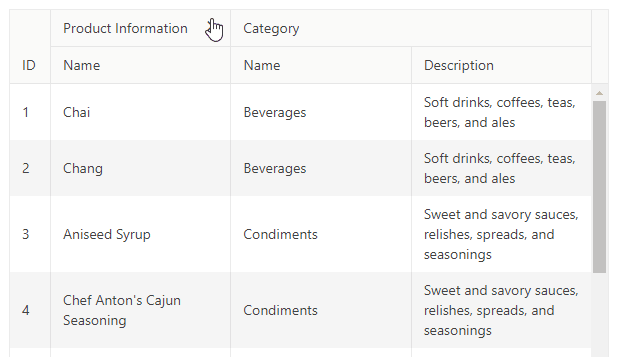

## Environment

<table>
	<tbody>
		<tr>
			<td>Product Version</td>
			<td>8.2.0</td>
		</tr>
		<tr>
			<td>Product</td>
			<td>Progress® KendoReact Grid</td>
		</tr>
	</tbody>
</table>

## Description

How can I collapse the columns inside the Grid header?

## Solution

This can be achieved by toggling a flag variable in the state that will determine whether or not the nested columns will render.






