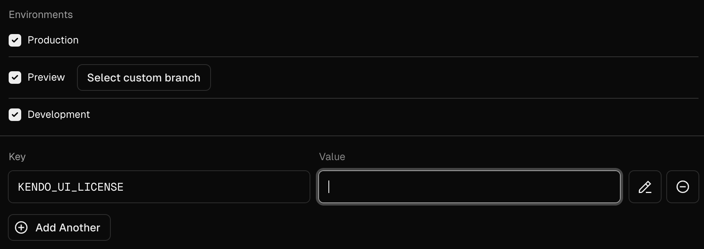
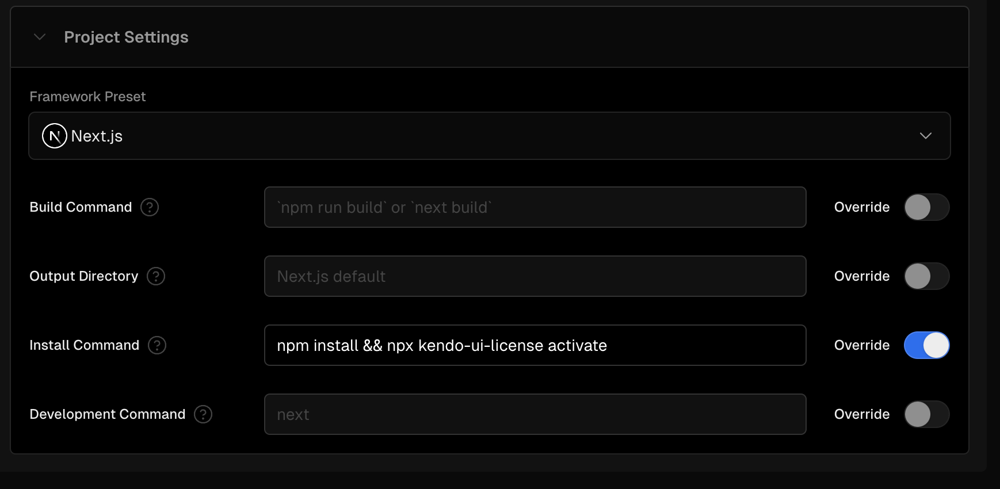
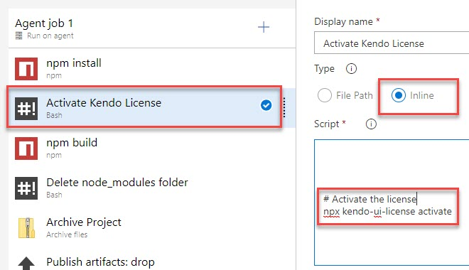
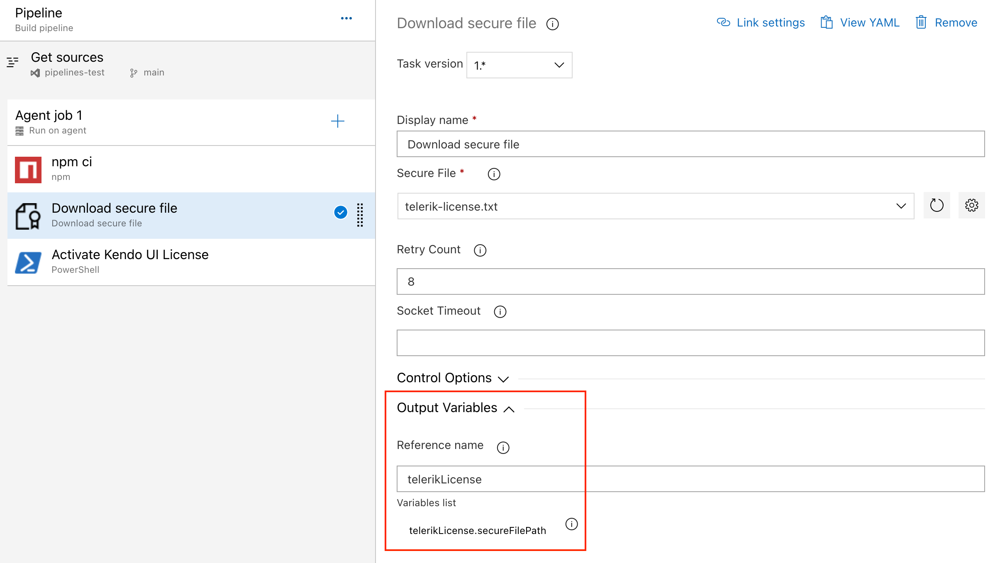
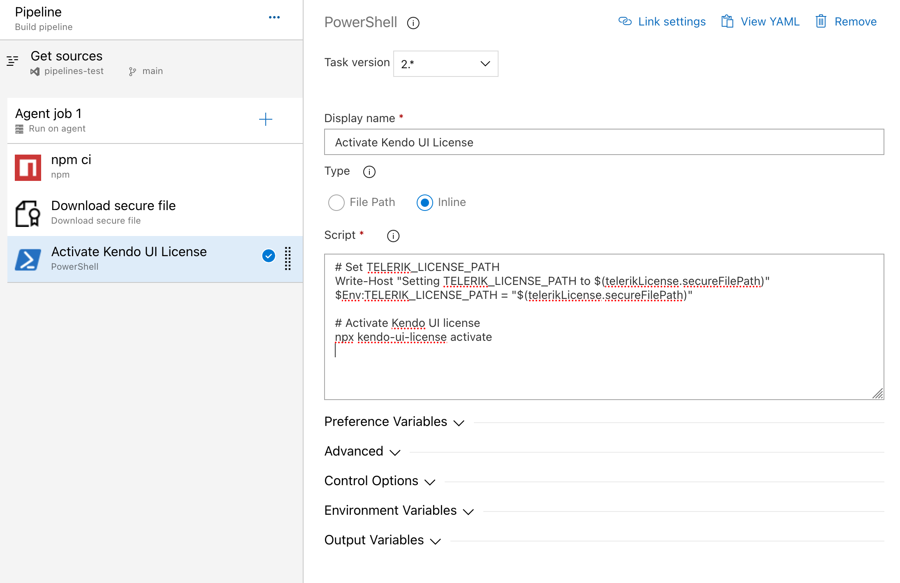

# Adding the License Key to CI Services

This section describes how to set up and activate your KendoReact [license key](slug:my_license#toc-download-your-license-key) across a few popular CI services by using environment variables or secrets. The license key must be present at build time. The recommended approach is to use an environment variable. Note that a license key is only required when using KendoReact premium components or features.

The following general requirements apply to all CI/CD environments:

-   Regardless of the CI/CD tool you use, the step that installs the project dependencies must be executed before the step that activates the license.
-   The license activation step requires the `@progress/kendo-licensing` package to be downloaded and set up in your local environment or CI/CD pipeline.
-   To activate the license, you need a securely stored license key, either in your environment variables or in the CI/CD tool's secret management. Hardcoding license keys into the build script is strictly discouraged.
-   The CI pipeline configurations are not executable. They merely outline the specific sequence of steps.

## Creating an Environment Variable

Each platform has a different process for setting environment variables. Some popular examples are listed below.

> Starting with the 2025 Q1 release, the name of the environment variable changes from `KENDO_UI_LICENSE` to `TELERIK_LICENSE` and the downloaded file changes from `kendo-ui-license.txt` to `telerik-license.txt`. This change is required as all Telerik UI and Kendo UI products now use the same licensing mechanism with a common license key. See the [Handling License Key File Name and Environment Variable Name Changes in the 2025 Q1 Release](slug:handling_license_file_name_changes) knowledge base article for more details.

### GitHub Actions

1. Create a new [Repository Secret](https://docs.github.com/en/actions/reference/encrypted-secrets#creating-encrypted-secrets-for-a-repository) or an [Organization Secret](https://docs.github.com/en/actions/reference/encrypted-secrets#creating-encrypted-secrets-for-an-organization). Set the name of the secret to `KENDO_UI_LICENSE` and paste the contents of the license file as value.
1. Add a build step to activate the license _after_ running `npm install` or `yarn`:

```yaml
steps:
    # ... install modules before activating the license
    - name: Install NPM modules
      run: npm install

    - name: Activate Kendo UI License
      # Set working directory if the application is not in the repository root folder:
      # working-directory: 'ClientApp'
      run: npx kendo-ui-license activate
      env:
          TELERIK_LICENSE: ${{ secrets.TELERIK_LICENSE }}

    # ... run application build after license activation
    - name: Build Application
      run: npm run build
```

### Vercel

1. In [vercel.com](https://vercel.com/), click on your profile button in the top right corner, select dashboard, select your project, and go to settings.
2. Go to the `Environment Variables` page and add the kendo license key. The variable name should be `TELERIK_LICENSE`.



3. Override the `Install Command` to include both the installation and license activation.



In the next deployment after completing these steps, the license will be activated for the KendoReact components in your project and will neither show a watermark or a warning message in the console.

### Azure Pipelines (YAML)

1. Create a new [User-defined Variable](https://docs.microsoft.com/en-us/azure/devops/pipelines/process/variables?view=azure-devops&tabs=yaml%2Cbatch) named `TELERIK_LICENSE`. Paste the content of the [downloaded license file](https://www.telerik.com/account/your-licenses/license-keys) as a value.
1. Add a build step to activate the license _after_ running `npm install` or `yarn`:

Syntax for Windows build agents:

```yaml
pool:
    vmImage: 'windows-latest'

steps:
    # ... install modules before activating the license
    - script: call npm install
      displayName: 'Install NPM modules'

    - script: call npx kendo-ui-license activate
      displayName: 'Activate Kendo UI License'
      # Set working directory if the application is not in the repository root folder:
      # workingDirectory: 'ClientApp'
      env:
          TELERIK_LICENSE: $(TELERIK_LICENSE)

    # ... run application build after license activation
    - script: call npm run build
      displayName: 'Build Application'
```

Syntax for Linux build agents:

```yaml
pool:
    vmImage: 'ubuntu-latest'

steps:
    # ... install modules before activating the license
    - script: npm install
      displayName: 'Install NPM modules'

    - script: npx kendo-ui-license activate
      displayName: 'Activate Kendo UI License'
      # Set working directory if the application is not in the repository root folder:
      # workingDirectory: 'ClientApp'
      env:
          TELERIK_LICENSE: $(TELERIK_LICENSE)

    # ... run application build after license activation
    - script: npm run build
      displayName: 'Build Application'
```

### Azure Pipelines (Classic)

1. Create a new [User-defined Variable](https://docs.microsoft.com/en-us/azure/devops/pipelines/process/variables?view=azure-devops&tabs=classic%2Cbatch) named `TELERIK_LICENSE`. Paste the contents of the license key file as value.
2. Add a new Bash task to the Agent job (before the npm build task)


3. Change the step to inline and use the following command

```bash
# Activate the license
npx kendo-ui-license activate
```



## Using Secure Files on Azure DevOps

[Secure files](https://learn.microsoft.com/en-us/azure/devops/pipelines/library/secure-files?view=azure-devops) are an alternative approach for sharing the license key file in Azure Pipelines that does not have the size limitations of environment variables.

You have two options for a file-based approach:

-   Set the `TELERIK_LICENSE_PATH` variable.
-   Add a file named `telerik-license.txt` to the project directory or a parent directory.

> Make sure you reference `@progress/kendo-licensing` v1.5.0 or later.

### YAML Pipeline

With a YAML pipeline, you can use the [DownloadSecureFile@1](https://learn.microsoft.com/en-us/azure/devops/pipelines/tasks/reference/download-secure-file-v1?view=azure-pipelines) task, then use `$(name.secureFilePath)` to reference it.

```yaml
# ... Install modules before activating the license.
- script: call npm install
  displayName: 'Install NPM modules'

- task: DownloadSecureFile@1
  name: DownloadTelerikLicenseFile # defining the 'name' is important
  displayName: 'Download Telerik License Key File'
  inputs:
      secureFile: 'telerik-license.txt'

- script: call npx kendo-ui-license activate
  displayName: 'Activate Kendo UI License'
  # Set a working directory if the application is not in the repository root folder:
  # workingDirectory: 'ClientApp'
  env:
      # use the name.secureFilePath value to set TELERIK_LICENSE_PATH
      TELERIK_LICENSE_PATH: $(DownloadTelerikLicenseFile.secureFilePath)
```

### Classic Pipeline

With a classic pipeline, use the “Download secure file” task and a PowerShell script to set `TELERIK_LICENSE_PATH` to the secure file path.

1. Add a “Download secure file” task and set the output variable's name to `telerikLicense`.
   

1. Add a PowerShell task and set the `TELERIK_LICENSE_PATH` variable and activate the license. Use the following script:

```bash
# Set TELERIK_LICENSE_PATH
Write-Host "Setting TELERIK_LICENSE_PATH to $(telerikLicense.secureFilePath)"
$Env:TELERIK_LICENSE_PATH = "$(telerikLicense.secureFilePath)"

# Activate Kendo UI license
npx kendo-ui-license activate
```



Alternatively, copy the file into the repository directory:

```bash
# Copy telerik-license.txt from secure file
echo "Copying $(telerikLicense.secureFilePath) to $(Build.Repository.LocalPath)/telerik-license.txt"
Copy-Item -Path $(telerikLicense.secureFilePath) -Destination "$(Build.Repository.LocalPath)/telerik-license.txt" -Force

# Activate Kendo UI license
npx kendo-ui-license activate
```

> If using [Task Groups](https://learn.microsoft.com/en-us/azure/devops/pipelines/release/task-groups?view=azure-devops), change the file name from `$(telerikLicense.secureFilePath)` to `$(Agent.TempDirectory)\telerik-license.txt` as output variables are not supported.

## Suggested Links

-   [Setting Up Your License Key](slug:my_license)
-   [License Activation Errors and Warnings](slug:license_activation_errors)
-   [Frequently Asked Questions about Your KendoReact License Key](slug:faq_license)
-   [Get Started with KendoReact Free](slug://free_components_introduction)
