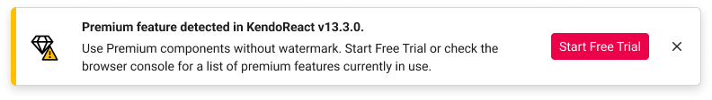
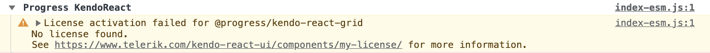

# License Activation Errors and Warnings

Using the KendoReact premium components and features without a license or with an invalid license causes specific license warnings and errors. This article defines what an invalid license is, explains what is causing it, and describes the related license warnings and errors.

> If you're looking for free React components, check out [Get Started with KendoReact Free](slug://getting_started_free_vs_premium).

## Invalid License

When using KendoReact premium components or features in your app, the `kendo-licensing` module may recognize your license as invalid in the following cases:

-   Using an expired subscription license&mdash;subscription licenses expire at the end of the subscription term.
-   Using an expired trial license.
-   A missing license for KendoReact.
-   Not [installing a license key](slug:my_license#install-or-update-the-license-key-file-in-your-project) in your application.
-   Not [updating the license key](slug:my_license#install-or-update-the-license-key-file-in-your-project) after renewing your KendoReact license.
-   Cached old (expired) license key.

When using the [KendoReact Free components and features](slug://getting_started_free_vs_premium), no license is required.

## License Warnings

If you use KendoReact premium components or features in a project with an expired or missing license, the UI components exhibit the following invalid license attributes:

-   A [watermark](#watermark) appears over the premium KendoReact components.
-   A [banner](#banner) is rendered on pages that use the KendoReact premium components.
-   A [warning message](#console-warning) is logged in the browser console of pages rendering the KendoReact premium components.

### Watermark

A watermark appearing in the `Light Theme` mode:

A watermark appearing in the `Dark Theme` mode:

### Banner

A banner with an action button appears on pages that use KendoReact premium components when the license is invalid, expired, or missing:

-   Clicking the action button redirects you to start a trial, purchase, or renew your license, depending on your license status.
-   Clicking the **x** button of the banner closes it until the page is reloaded.

### Console Warning

A warning message similar to the following is logged in the browser's console:

## License Activation Errors

If you use KendoReact premium components and features in a project with an expired or missing license, [the `kendo-ui-license activate` command](slug:my_license#install-or-update-the-license-key-file-in-your-project) will indicate the following errors or conditions:

| Error or Condition                                       | Message Code       | Solution                                                                                                                                                                                                                                                                                                                                  |
| -------------------------------------------------------- | ------------------ | ----------------------------------------------------------------------------------------------------------------------------------------------------------------------------------------------------------------------------------------------------------------------------------------------------------------------------------------- |
| `No license key is detected`                             | `TKL002`           | [Install a license key](slug:my_license) to activate the premium UI components and remove the error message.                                                                                                                                                                                                                              |
| `Invalid license key`                                    | `TKL003`           | [Download a new license key](slug:my_license#download-your-license-key-file) and install it to activate the KendoReact premium components and remove the error message.                                                                                                                                                                   |
| `Your subscription license has expired.`                 | `TKL103`, `TKL104` | Renew your subscription and [download a new license key](slug:my_license#download-your-license-key-file).                                                                                                                                                                                                                                 |
| `Your perpetual license is invalid.`                     | `TKL102`           | You are using a product version released outside the validity period of your perpetual license. To remove the error message, do either of the following:  - Renew your license, download a new license key, and install it.  - Downgrade to a product version included in your perpetual license as indicated in the message. |
| `Your trial license has expired.`                        | `TKL105`           | Purchase a commercial license to continue using the premium components and features of the product.                                                                                                                                                                                                                                       |
| `Your license is not valid for the detected product(s).` | `TKL101`           | Review the purchase options for the listed products. Alternatively, remove the references to the listed packages from `package.json`.                                                                                                                                                                                                  |

## See Also

-   [Setting Up Your License Key](slug:my_license)
-   [Adding the License Key to CI Services](slug:my_license#add-the-license-key-to-ci-services)
-   [Frequently Asked Questions](slug:faq_license)
-   [Get Started with KendoReact Free](slug://getting_started_free_vs_premium)
