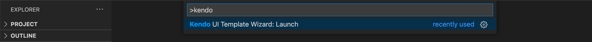

# Productivity Tools Extension for VS Code

The Kendo UI Productivity Tools extension for Visual Studio (VS) Code enhances the experience of developing web applications with KendoReact components.

<CtaPanelOverview></CtaPanelOverview>

The extension facilitates the creation of new projects by providing a powerful template wizard. It also allows you to add KendoReact components to an existing project with a few clicks and, at that, directly in the source code through snippets which automatically handle the code generation process.

## Installation

You can install the Kendo UI Productivity Tools extension for Visual Studio Code through:

-   The [Visual Studio Marketplace](https://marketplace.visualstudio.com/items?itemName=KendoUI.kendotemplatewizard).

-   The **Extensions** tab in Visual Studio Code:
    1. Search for **Kendo UI Productivity Tools**.
    2. Select the extension from the results list.
    3. Click the **Install** button.

## Key Features

The Kendo UI Productivity Tools extension provides a number of handy and developer-friendly tools that facilitate the project creation and integration of the KendoReact components. The KendoReact team constantly invests efforts to further enhance the existing functionalities and develop new features.

### Project Wizard

The Kendo UI Productivity Tools extension eases the development efforts by providing an interface for creating new projects that are pre-configured for KendoReact components. The Create New Project Wizard provides a blank project template, which you can enhance by selecting your preferred React framework integration: NextJS, Astro, or Vite. Available for both tiers. You can easily configure the styling for your application by choosing between the Default, Bootstrap, Material and Fluent themes. The result is a ready-to-run application with all required configurations and dependencies. For more information, see the article about the [KendoReact Template Wizard]().

### Code Snippets

The Kendo UI Productivity Tools extension provides rich support for KendoReact component snippets, such as Grid, Inputs, Layouts, Chart, and so on. These snippets facilitate the development process by providing a quick way for adding the components with predefined tab stops for additional configuration of their properties. For more information, see the article about [KendoReact code snippets]().

### Scaffolders

The KendoReact Scaffolders enable you to quickly add components to your existing app.
Scaffolders ease the process of generating and integrating new Kendo UI components in existing projects. The tool enables you to create complex Kendo UI components with a lot of repetitive configuration (like the Grid, Chart, Inputs, and others), by selecting options from a seamless interactive wizard-like UI.

## Suggested Links

-   [Download the Kendo UI Productivity Tools Extension](https://marketplace.visualstudio.com/items?itemName=KendoUI.kendotemplatewizard)
-   [Productivity Tools VS Code Template Project Wizard]()
-   [Productivity Tools VS Code for Code Snippets]()
-   [Productivity Tools VS Code Scaffolders (Beta)]()
