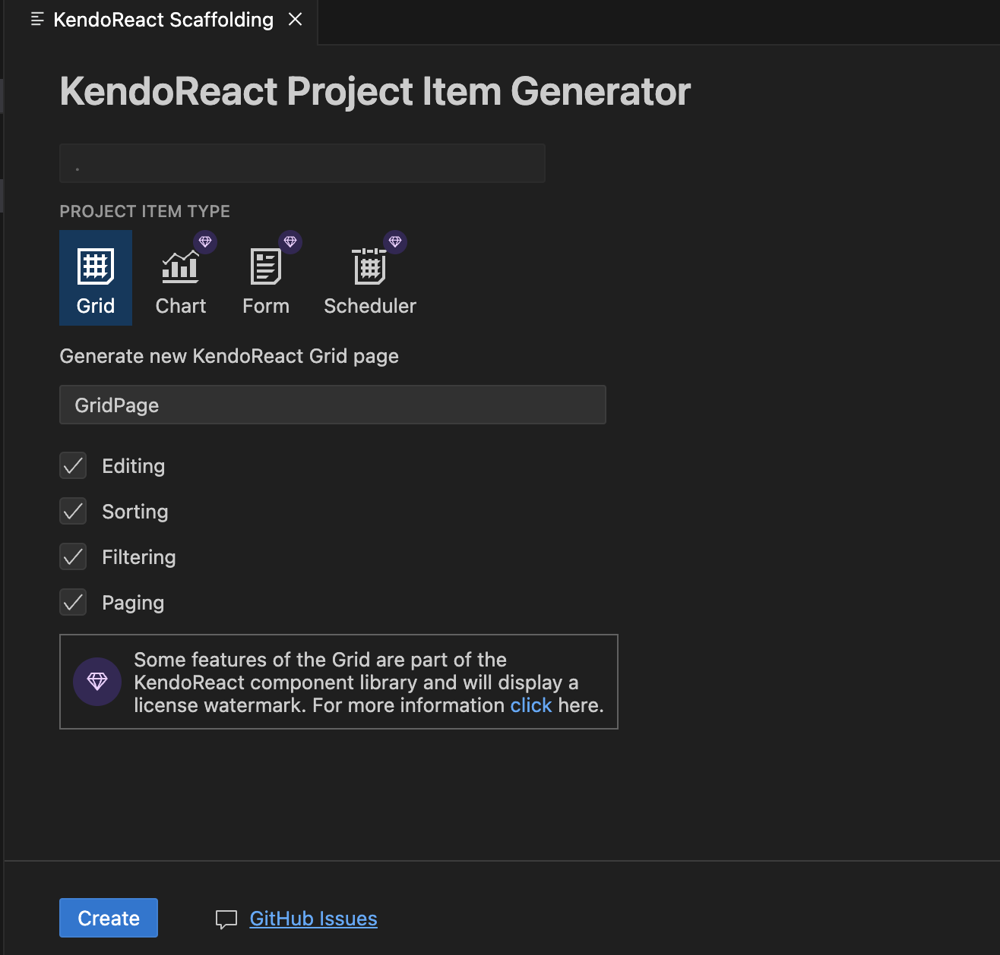

# Generating Complex Components by Scaffolding

The Kendo UI Productivity Tools extension for Visual Studio (VS) Code includes a scaffolding feature, which enables you to generate complex KendoReact components from an interactive wizard-like user interface.

To utilize the Scaffolders functionality, follow the steps below:

1. Right-click on a folder from your React project tree.
1. Select the **New KendoReact Project Item** option which will open the **Scaffolder** tab.

    

1. Select a component from the list. Currently, the Data Grid, Chart, Form, and Scheduler KendoReact components support scaffolding.

    

1. Click the **Create** button.

## Suggested Links

* [Download the Kendo UI Productivity Tools Extension for VS Code](https://marketplace.visualstudio.com/items?itemName=KendoUI.kendotemplatewizard)
* [Overview of the Kendo UI Productivity Tools VS Code Extension]()
* [Productivity Tools VS Code Template Project Wizard]()
* [Productivity Tools VS Code for Code Snippets]()
