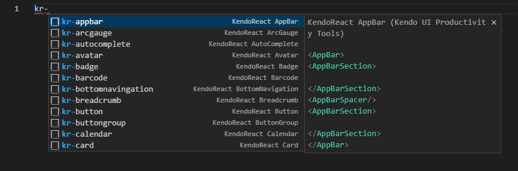

# Adding Code Snippets with the Productivity Tools

The Kendo UI Productivity Tools extension for Visual Studio (VS) Code provides a handy feature for improving the daily development with the React components library&mdash;code snippets for fast UI component reference and configuration.

Snippets simplify and accelerate the implementation of KendoReact components in your project. They facilitate the development process by providing a quick way for adding the components directly to the source code, while also including predefined tab stops for the required options.

> The KendoReact snippets library consists of many components such as Grid, Inputs, Layouts, and more.

To take advantage of the dozens of available code snippets:

1. Open the source code in the IDE and click where you want to insert the KendoReact component.
2. To list the KendoReact snippets, type the `kr-` snippet prefix.
3. Continue by typing the name of the component that you want to insert. Some components are provided by multiple snippets which allow you to create them in various ways depending on the desired configuration.
4. Press `Enter` to insert the desired component in the source code.
5. (Optional) If the component provides placeholders for specific properties, iterate and provide them by pressing the `Tab` key.

## Code Snippets Library

The following table lists the available KendoReact code snippet libraries per component with their references.

|COMPONENT                    | SNIPPETS|
|:---                         |:---   |
|**Barcodes**|
|Barcode                      |`kr-barcode`|
|QRCode                       |`kr-qrcode`|
|**Buttons**|
|Button                       |`kr-button`|
|ButtonGroup                  |`kr-buttongroup`|
|Chip                         |`kr-chip`|
|ChipList                     |`kr-chiplist`|
|DropDownButton               |`kr-dropdownbtn`|
|FloatingActionButton         |`kr-floatingactionbtn`|
|Toolbar                      |`kr-toolbar`|
|SplitButton                  |`kr-splitbtn`|
|**Charts**|
|Chart                        |`kr-chart`|
|Sparkline                    |`kr-sparkline`|
|StockChart                   |`kr-stockchart`|
|**Conversational UI**|
|Chat                         |`kr-chat`|
|**Grid**|
|Grid                         |`kr-grid`|
|GridColumn                   |`kr-gridcolumn`|
|**Data Tools**|
|Filter                       |`kr-filter`|
|Pager                        |`kr-pager`|
|**DateInputs**|
|Calendar                     |`kr-calendar`|
|DateInput                    |`kr-dateinput`|
|DatePicker                   |`kr-datepicker`|
|DateRangePicker              |`kr-daterangepicker`|
|DateTimePicker               |`kr-datetimepicker`|
|MultiViewCalendar            |`kr-multiviewcalendar`|
|TimePicker                   |`kr-timepicker`|
|**Dialogs**|
|Dialog                       |`kr-dialog`|
|Window                       |`kr-window`|
|**Dropdowns**|
|AutoComplete                 |`kr-autocomplete`|
|ComboBox                     |`kr-combobox`|
|DropDownList                 |`kr-dropdownlist`|
|DropDownTree                 |`kr-dropdowntree`|
|MultiColumnComboBox          |`kr-multicolumncombobox`|
|MultiSelect                  |`kr-multiselect`|
|MultiSelectTree              |`kr-multiselecttree`|
|**Editor**|
|Editor                       |`kr-editor`|
|**Excel Export**|
|ExcelExport                  |`kr-excelexport`|
|**Form**|
|Form                         |`kr-form`|
|**Gantt**|
|Gantt                        |`kr-gantt`|
|**Gauges**|
|ArcGauge                     |`kr-arcgauge`|
|CircularGauge                |`kr-circulargauge`|
|LinearGauge                  |`kr-lineargauge`|
|RadialGauge                  |`kr-radialgauge`|
|**Indicators**|
|Badge                        |`kr-badge`|
|Loader                       |`kr-loader`|
|Skeleton                     |`kr-skeleton`|
|**Inputs**|
|CheckBox                     |`kr-checkbox`|
|ColorGradient                |`kr-colorgradient`|
|ColorPalette                 |`kr-colorpalette`|
|ColorPicker                  |`kr-colorpicker`|
|FlatColorPicker              |`kr-flatcolorpicker`|
|Input                        |`kr-input`|
|MaskedTextBox                |`kr-maskedtextbox`|
|NumericTextBox               |`kr-numerictextbox`|
|RadioButton                  |`kr-radiobtn`|
|RadioGroup                   |`kr-radiogroup`|
|RangeSlider                  |`kr-rangeslider`|
|Slider                       |`kr-slider`|
|Rating                       |`kr-rating`|
|Switch                       |`kr-switch`|
|TextArea                     |`kr-textarea`|
|**Labels**|
|Label                        |`kr-label`|
|FloatingLabel                |`kr-floatinglabel`|
|Hint                         |`kr-hint`|
|Error                        |`kr-error`|
|**Layout**|
|AppBar                       |`kr-appbar`|
|Avatar                       |`kr-avatar`|
|BottomNavigation             |`kr-bottomnavingation`|
|Breadcrumb                   |`kr-breadcrumb`|
|Card                         |`kr-card`|
|Drawer                       |`kr-drawer`|
|ExpansionPanel               |`kr-expansionpanel`|
|GridLayout                   |`kr-gridlayout`|
|Menu                         |`kr-menu`|
|PanelBar                     |`kr-panelbar`|
|Splitter                     |`kr-splitter`|
|StackLayout                  |`kr-stacklayout`|
|TabStrip                     |`kr-tabstrip`|
|Stepper                      |`kr-stepper`|
|TileLayout                   |`kr-tilelayout`|
|**ListBox**|
|ListBox                      |`kr-listbox`|
|**ListView**|
|ListView                     |`kr-listview`|
|**Notification**|
|Notification                 |`kr-notification`|
|**PivotGrid**|
|PivotGrid                    |`kr-pivotgrid`|
|**Popup**|
|Popup                        |`kr-popup`|
|**ProgressBar**|
|ProgressBar                  |`kr-progressbar`|
|**Ripple**|
|Ripple                       |`kr-ripple`|
|**Scheduler**|
|Scheduler                    |`kr-scheduler`|
|**ScrollView**|
|ScrollView                   |`kr-scrollview`|
|**Sortable**|
|Sortable                     |`kr-sortable`|
|**TaskBoard**|
|TaskBoard                    |`kr-taskboard`|
|**Popover**|
|Popover                      |`kr-popover`|
|**Tooltip**|
|Tooltip                      |`kr-tooltip`|
|**TreeList**|
|TreeList                     |`kr-treeList`|
|**TreeView**|
|TreeView                     |`kr-treeView`|
|**Upload**|
|Upload                       |`kr-upload`|

## Suggested Links

* [Download the Kendo UI Productivity Tools Extension](https://marketplace.visualstudio.com/items?itemName=KendoUI.kendotemplatewizard)
* [Overview of the Kendo UI Productivity Tools VS Code Extension]()
* [Productivity Tools VS Code Template Project Wizard]()
* [Productivity Tools VS Code Scaffolders (Beta)]()
