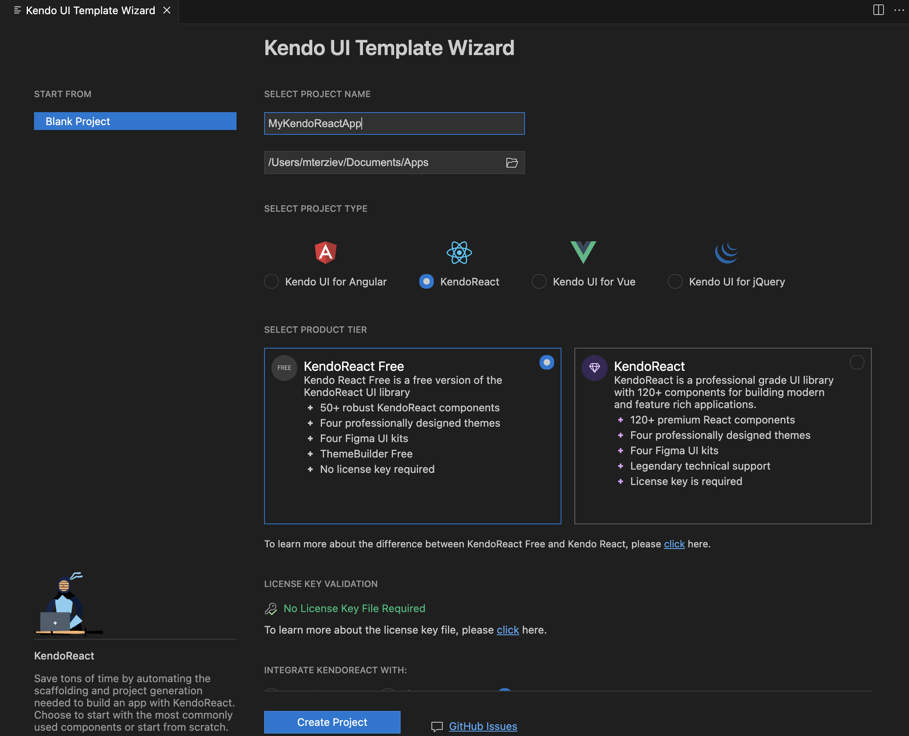
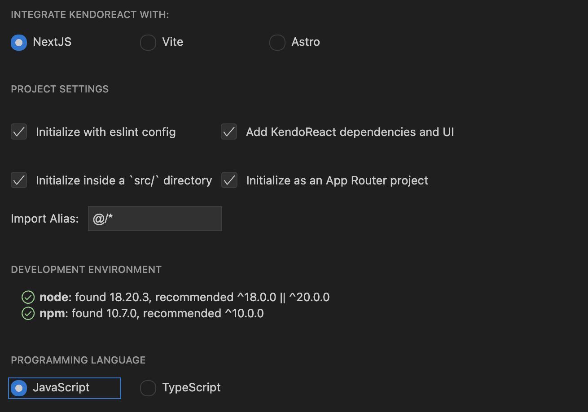
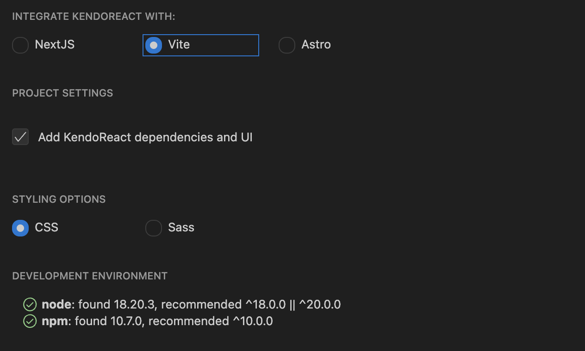
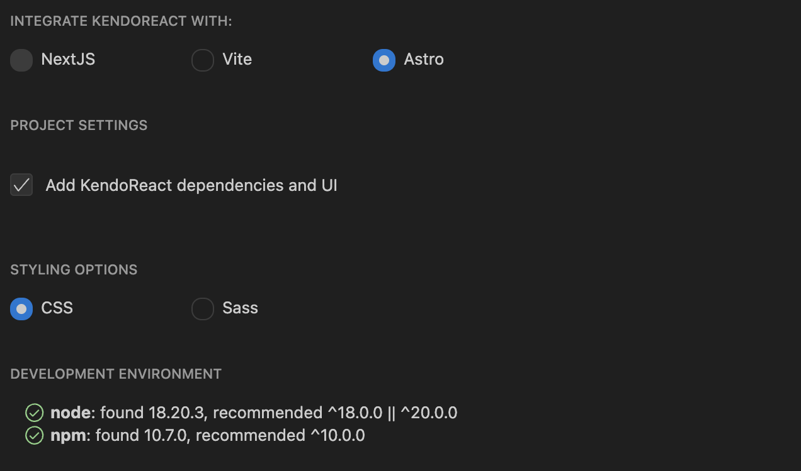
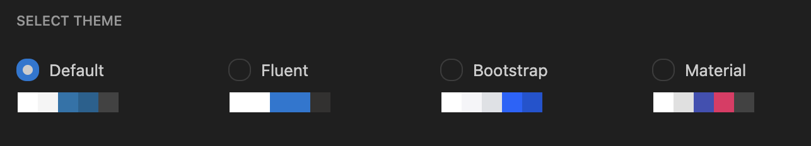

# Using the Create New Project Wizard for VS Code

The [Kendo UI Template Wizard for Visual Studio (VS) Code](https://marketplace.visualstudio.com/items?itemName=KendoUI.kendotemplatewizard) is a tool for scaffolding and building React applications with KendoReact.

The Template Wizard provides pre-built templates to easily set up React applications by using the KendoReact components.

**Figure 1: Creating a project**
    

To create a new KendoReact project:

1. Select your product tier. This affects the dependencies installed in your project and disables or enables the built-in license key management (disabled for KendoReact Free).
KendoReact Free is a free version of the KendoReact component library and includes 50+ customizable, enterprise-grade React components. Using the components and features in this tier does not require any sign-up or license.
KendoReact provides the complete set of 120+ React components. This tier requires a valid commercial license or an active trial license.
2. Select your preferred React framework integration: NextJS, Astro, or Vite. Available for both tiers.

- NextJS 
- Vite 
- Astro 

Based on the selected integration, finalize your project settings. Note that the different product tiers install different dependencies.

## Styling

The Template Wizard for VS Code allows you to select one of the [supported KendoReact themes]() and start your application with it.

**Figure 3: Choosing a theme**
    

## Setup

To set up the Template Wizard for VS Code:

1. Install the Wizard from the VS Code extension section.
1. Open the command palette with `Ctrl`+`Shift`+`P` on Windows or `Cmd`+`Shift`+`P` on macOS, and search for **Kendo UI Template Wizard Launch**.
1. Select your preferred React framework integration.
1. Select your preferred theme.
1. Click the **Create** button to finish the setup.
1. Install the NPM dependencies by typing `npm install` in the terminal.
1. Run the application by typing `npm start` in the terminal.

You can also check the detailed guide for the [Kendo UI Template Wizard for VS Code](https://www.telerik.com/blogs/kendo-ui-template-wizard-for-visual-studio-code).

## Suggested Links

- [Getting Started with KendoReact]()
- [Overview of the Kendo UI Productivity Tools VS Code Extension]()
- [Productivity Tools VS Code Scaffolders (Beta)]()
- [Productivity Tools VS Code for Code Snippets]()
