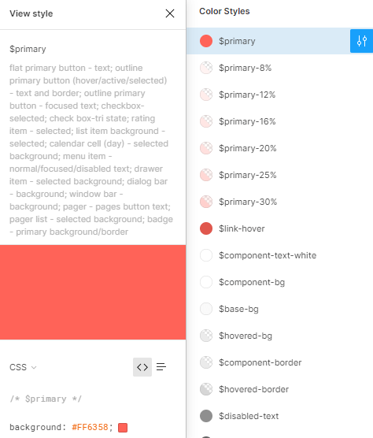

# ThemeBuilder Overview

[ThemeBuilder](https://www.telerik.com/themebuilder) is a web application that enables you to create new and customize existing themes.

[The ThemeBuilder application](https://themebuilderapp.telerik.com) helps you achieve a unique appearance for your React apps and delivers full control over the visual elements of the KendoReact UI components. After you create or customize your theme, you can download it and integrate it in your project.

To learn more about using ThemeBuilder, visit the [ThemeBuilder documentation portal](https://docs.telerik.com/themebuilder).

> Starting with R3 2022, ThemeBuilder is accessible from a [new URL](https://themebuilderapp.telerik.com). This new ThemeBuilder version replaces the previous ThemeBuilder and provides more free features and also a Pro tier. All your existing custom themes will continue to work in the new ThemeBuilder.

## Implementing Design Requirements

If you work with designers, ThemeBuilder allows you to style the KendoReact components as required by your application's design and to apply your brand colors.

To improve the collaboration between designers and developers, KendoReact comes with [three UI Kits for Figma](): Material, Bootstrap, and Kendo UI Default. Your designers will use them to create the required application design and to apply your brand colors. To implement these design requirements, you need to create a new theme in ThemeBuilder and customize it:

1. Request from the designer to send you a link to the UI kit with the customized colors in Figma.
1. Use the link to open the design in Figma.
    > If you don't have a Figma account, you can create one for free.
1. Navigate to the **Components** page and locate the **Color Styles** in the [Inspect Panel](https://help.figma.com/hc/en-us/articles/15023124644247-Guide-to-Dev-Mode), where you can find the values of all colors used in the design.

    

1. Create a new theme in the ThemeBuilder application.
    - To select the correct **Base Theme**, ask your designer which UI Kit was used: **Default**, **Bootstrap**, or **Material**.
1. Copy the color codes from the **Color Styles** in Figma and paste them in the ThemeBuilder color editor with the same name. For example, copy the value of the `$kendo-color-primary` color in Figma and paste it in the **Primary** color editor in the ThemeBuilder.

## Suggested Links

-   [Themes and Styling with KendoReact]()
-   [Preview of the KendoReact Default Theme for React](https://www.telerik.com/design-system/docs/themes/kendo-themes/default/)
-   [Preview of the KendoReact Bootstrap Theme for React](https://www.telerik.com/design-system/docs/themes/kendo-themes/bootstrap/)
