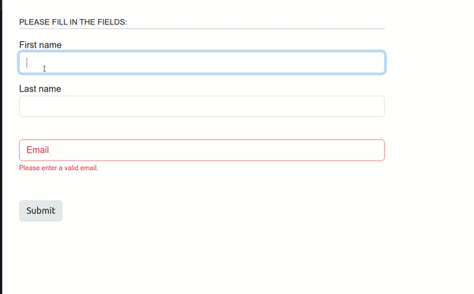

## Environment
<table>
	<tbody>
		<tr>
			<td>Product Version</td>
			<td>5.5.0</td>
		</tr>
		<tr>
			<td>Product</td>
			<td>Progress® KendoReact</td>
		</tr>
	</tbody>
</table>

## Description
I want to visualise a spinner icon once the form has been submitted.

## Solution
This can be achieved by using the iconClass props and conditionally changing the className to that of a spinner or loader based on the disabled variable.




